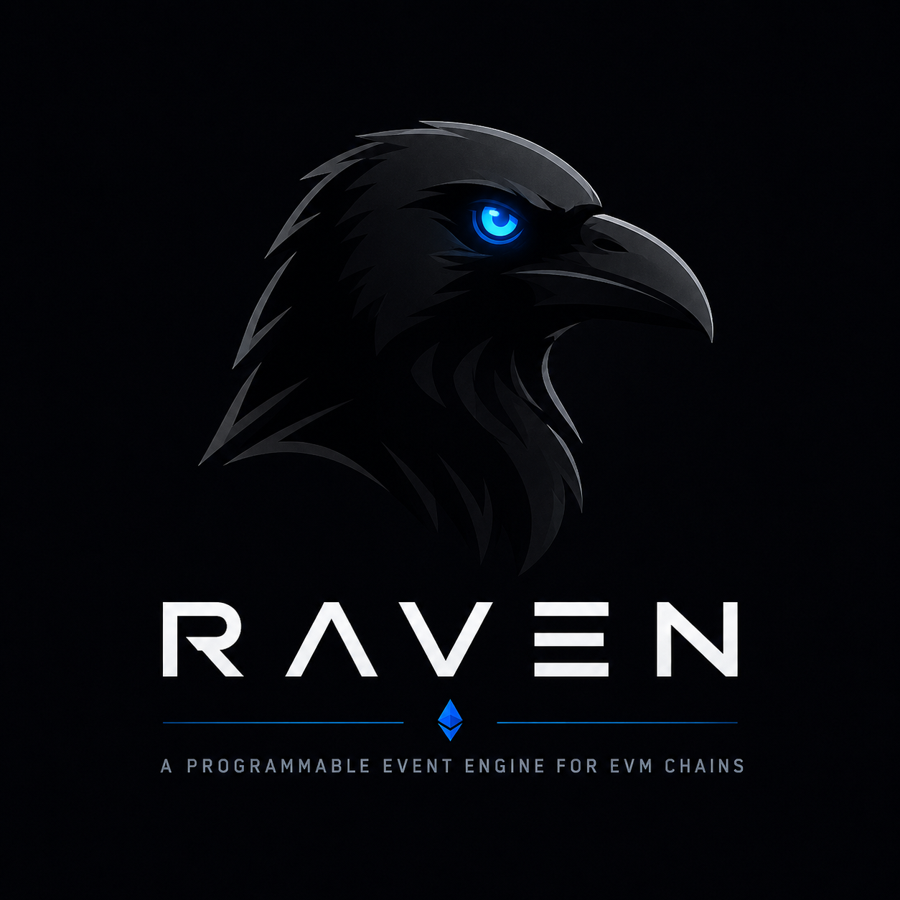
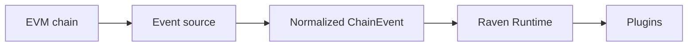

# Raven

<p align="center">
  
</p>

<p align="center">
  <strong>A programmable blockchain event runtime powered by plugins.</strong>
</p>

<p align="center">
  Build event-driven blockchain applications with normalized chain events,
  a source-independent runtime, and reusable Rust plugins.
</p>

## Why Raven?

Blockchain applications often rebuild the same RPC ingestion, block
normalization, and event dispatch pipeline. Raven separates that infrastructure
from application behavior:



The Alloy source owns JSON-RPC access, `raven-core` owns validated event types,
the runtime owns lifecycle and dispatch, and plugins own application logic.

## Current features

- Event-driven, async Rust architecture
- Validation-preserving construction and deserialization for core events
- Unique-name plugin registration and lifecycle hooks
- Independent plugin workers with bounded FIFO mailboxes
- Non-blocking fan-out, immediate delivery receipts, and live per-plugin outcomes
- Error isolation and panic quarantine without blocking sibling plugins
- Automatic EIP-155 chain discovery with no chain allowlist
- Runtime state and per-chain validation
- Transport-aware Alloy ingestion: HTTP polling or WS subscriptions with reconciliation
- Persistent RPC URL configuration with CLI and environment overrides
- Working CLI orchestration with graceful Ctrl+C shutdown
- Normalized event boundary designed for future Reth ExEx support

> **Important:** Raven is early-stage. Reorg detection, dynamic plugin
> installation, and Reth ExEx integration are planned but not yet implemented.

## Getting started

### Prerequisites

- Rust 1.91 or newer
- Cargo
- An EVM-compatible HTTP(S) or WS(S) JSON-RPC endpoint

### Build and test

```bash
git clone https://github.com/abhi3700/raven.git
cd raven

cargo build --workspace
cargo test --workspace --all-targets
```

### Run with Alloy

Pass an endpoint directly:

```bash
cargo run -p raven -- run \
  --source alloy \
  --rpc-url https://your-evm-rpc.example
```

Persist the endpoint once and then run without repeating it:

```bash
raven config set --rpc-url http://localhost:8545
raven config get
raven run
```

You can also configure it for the current environment:

```bash
export NODE_RPC_URL="http://localhost:8545"
cargo run -p raven -- run
```

WebSocket endpoints work through persisted config, the option, or the
environment variable:

```bash
raven run --rpc-url wss://your-evm-rpc.example
```

Resolution order is `--rpc-url`, then `NODE_RPC_URL`, then persisted config.
Run `raven config clear` to remove the persisted value.

Raven calls `eth_chainId`, accepts any non-zero EIP-155 chain ID, and initializes
the runtime from the first event. There is no Ethereum-mainnet allowlist. It
then fetches full blocks, sends normalized events through the runtime, and logs
each block with the built-in `block-logger` plugin. HTTP(S) polls for new
heights; WS(S) subscribes to `newHeads` and periodically reconciles missed
heights. Press Ctrl+C to shut down cleanly.

One Raven process handles one discovered chain so event ordering and plugin
state cannot accidentally cross chains. Run separate Raven processes to ingest
multiple EVM chains concurrently.

Tune the polling interval when needed:

```bash
cargo run -p raven -- run \
  --rpc-url http://localhost:8545 \
  --poll-interval-ms 1000
```

For WS(S), tune the lower-frequency safety reconciliation independently:

```bash
raven run \
  --rpc-url wss://your-evm-rpc.example \
  --reconciliation-interval-ms 30000
```

Use `cargo run -p raven -- --help` for the full CLI help.

## Write a plugin

```rust
use async_trait::async_trait;
use raven_core::ChainEvent;
use raven_plugin_sdk::{
    Plugin, PluginContext, PluginMetadata, PluginResult,
};

struct BlockLogger;

#[async_trait]
impl Plugin for BlockLogger {
    fn metadata(&self) -> PluginMetadata {
        PluginMetadata::new(
            "block-logger",
            env!("CARGO_PKG_VERSION"),
            "Logs newly applied blocks",
        )
    }

    async fn handle_event(
        &mut self,
        event: &ChainEvent,
        _context: &PluginContext,
    ) -> PluginResult {
        println!("block #{}", event.block_number());
        Ok(())
    }
}
```

Run the self-contained SDK example:

```bash
cargo run -p raven-plugin-sdk --example block_logger
```

## Workspace structure

```text
raven/
├── crates/
│   ├── raven-cli/           # CLI and source/runtime orchestration
│   ├── raven-core/          # Validated normalized chain events
│   ├── raven-plugin-sdk/    # Plugin contract and context
│   ├── raven-runtime/       # Registry, lifecycle, and dispatcher
│   └── raven-source-alloy/  # Alloy HTTP/WebSocket JSON-RPC source
├── docs/                    # Mintlify MDX pages
├── docs.json                # Mintlify site configuration
├── res/                     # Brand assets
└── README.md
```

## Documentation

The complete Mintlify documentation starts at
[docs/index.mdx](./docs/index.mdx). Its navigation and theme are configured in
[docs.json](./docs.json).

The [design principles](./docs/concepts/design-principles.mdx) reconcile the
project vision with current architectural boundaries.

Preview the site locally with Node.js 20.17 or newer:

```bash
npm install -g mint
./doc.sh
```

The preview uses port `3777` by default. Override it or pass additional
Mintlify flags when needed:

```bash
MINTLIFY_PORT=4000 ./doc.sh --no-open
```

Before publishing documentation changes:

```bash
mint broken-links
mint validate
```

## Roadmap

The next milestone focuses on correctness before expanding the plugin catalog:

- Delivery semantics and durable checkpoint ownership
- Lifecycle timeouts, worker health, restart supervision, and multi-error reporting
- Retry and backoff for transient RPC failures
- Historical starting-block and resume configuration
- Reorg-aware applied and reverted block events
- A large ERC-20 transfer plugin as the first vertical slice

See the [full roadmap](./docs/reference/roadmap.mdx) for implemented and planned
capabilities, exit criteria, and later Reth/plugin-platform work.

## License

MIT OR Apache-2.0
