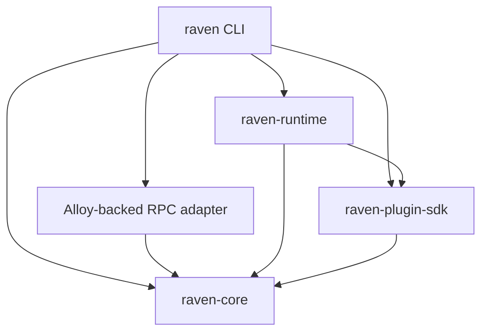
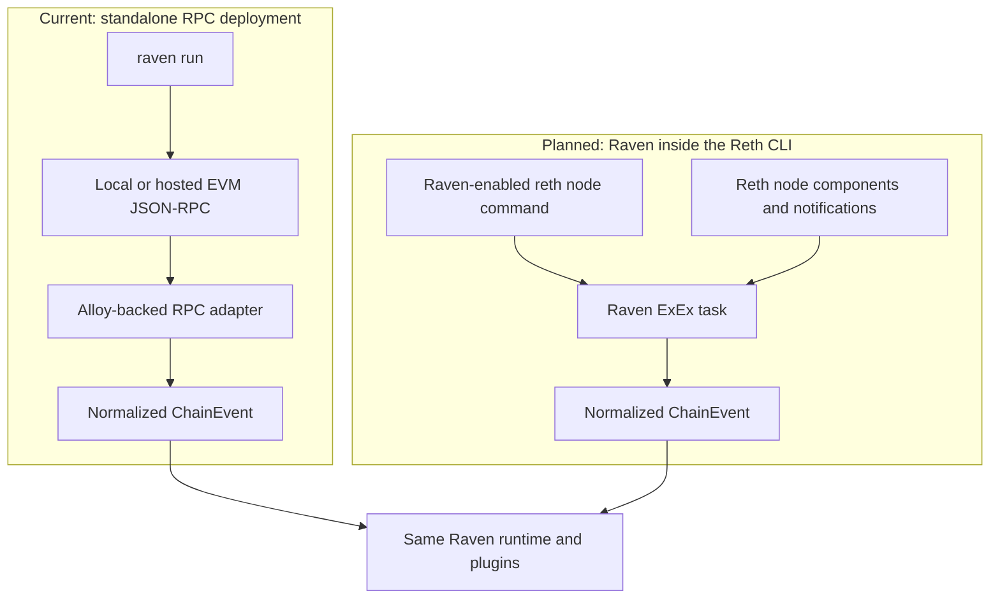
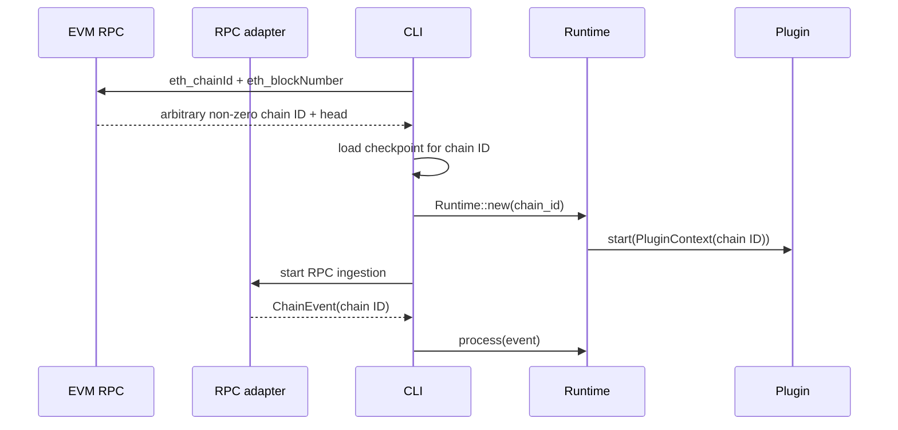
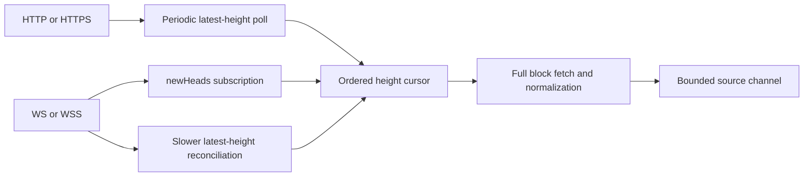
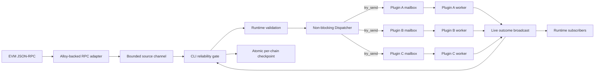
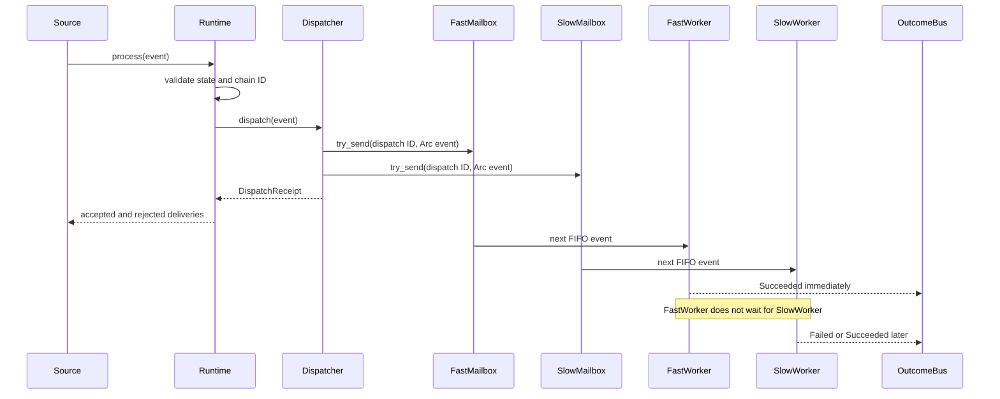
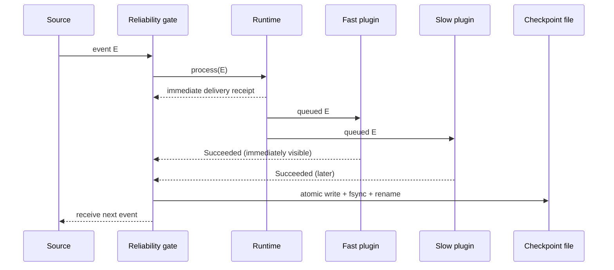
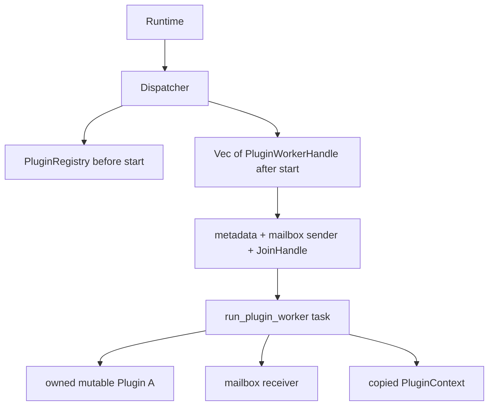

Raven is a source-independent EVM event runtime with an actor-style plugin
system. One source normalizes chain data once; the runtime then attempts to
enqueue each event into every plugin's independent worker mailbox.

The central dispatch rule is:

> A slow or failing plugin must not delay the delivery result or event outcome
> of another plugin.

## High-level design

### Workspace boundaries

Arrows mean "depends on":



| Layer | Responsibility | Does not own |
| --- | --- | --- |
| Source | Chain access, retry, canonical reconciliation, catch-up, and conversion into `ChainEvent` | Plugin behavior |
| Core | Validated, source-independent event values | Runtime control messages |
| Runtime | Chain validation, plugin lifecycle, mailboxes, dispatch, and outcomes | Protocol-specific application logic |
| Plugin SDK | The `Plugin` contract, context, metadata, and error vocabulary | Scheduling policy |
| Plugin | Stateful application behavior for normalized events | Shared chain ingestion |
| CLI | Config and checkpoint persistence, reliability gate, composition, diagnostics, Ctrl+C, and graceful shutdown | Reusable domain logic |

### Deployment modes and the CLI boundary

Raven distinguishes ingestion mechanisms, not who owns an RPC endpoint. A
self-hosted node and a hosted provider both expose JSON-RPC, and a URL cannot
reliably prove whether a proxy or endpoint is operated locally.



The current operator interface is therefore intentionally small:

```bash
raven run --rpc-url https://your-evm-rpc.example
```

There is no `--source alloy` option. Alloy is an internal client-library choice,
while the URL scheme is a real runtime choice: HTTP(S) selects polling and
WS(S) selects subscriptions plus reconciliation.

Reth ExEx is a different deployment topology, not another value for the same
flag. Reth documents that ExEx tasks are compiled into the node binary and run
alongside the node through shared memory; they do not attach to an existing
Reth process. Raven therefore plans a version-pinned **Raven-enabled Reth CLI**,
not `raven run --source reth`. Operators will run a normal Reth node command
with Raven/plugin options; its node builder will install the Raven ExEx before
launch. Raven then runs in-process alongside that node, while the standalone
`raven` binary remains the lightweight RPC deployment.

```text
standalone: raven run --rpc-url ... -> Alloy RPC source -> Raven runtime

embedded:   reth node [normal node args] + Raven plugin config
                -> NodeBuilder::install_exex("raven", ...)
                -> Raven runtime and plugins alongside the node
```

The embedded adapter will translate `ChainCommitted`, `ChainReverted`, and
`ChainReorged` notifications into the same validated event model and can use
`ExExContext` providers/components for additional state reads. Only after every
Raven plugin has durably succeeded may it report Reth's `FinishedHeight`.
Because that acknowledgement also allows Reth to prune older data, enqueueing
alone is not sufficient.

Reading an active Reth database directly from a separate Raven process is not
the planned production boundary. It would couple Raven to Reth's storage layout
and still would not itself provide a coherent stream of canonical commits,
reverts, and reorgs. ExEx supplies that lifecycle-aware stream. If Raven must
remain a separate process, a remote ExEx bridge can explicitly stream
notifications over a versioned protocol; Reth documents gRPC as one example.

| Situation | Raven path |
| --- | --- |
| Hosted EVM endpoint | `raven run --rpc-url ...` |
| Self-hosted node exposing HTTP(S) or WS(S) | `raven run --rpc-url ...` |
| Existing Reth node without Raven compiled in | Use its RPC endpoint, or restart with the planned Raven-enabled Reth CLI |
| Start Reth and Raven/plugins together without RPC | Planned Raven-enabled `reth node` command with an installed ExEx |
| Separate Raven process receiving ExEx events | Possible future remote-ExEx adapter, not direct DB access |

See Reth's [ExEx overview](https://reth.rs/exex/overview/), current
[`install_exex` API](https://reth.rs/docs/reth/builder/struct.WithLaunchContext.html#method.install_exex),
and [`ExExEvent::FinishedHeight`](https://reth.rs/docs/reth_exex/enum.ExExEvent.html)
for the execution, CLI-builder, and acknowledgement boundaries.

### Chain-agnostic runtime binding

Raven has no chain allowlist. The source discovers any non-zero EIP-155 chain
ID and includes it in every normalized event. The CLI checks the endpoint first
so it can select a chain-specific checkpoint and create the runtime before
ingestion starts:



A runtime remains single-chain by design: after binding, it rejects events with
a different chain ID. This protects per-plugin ordering and state. Multi-chain
deployments currently run one Raven process per RPC endpoint.

### Transport-aware source ingestion

At the high level, transport affects how Raven learns that a new height exists;
it does not change event normalization or downstream dispatch:



HTTP(S) polls `eth_blockNumber` every four seconds by default. WS(S) uses
`eth_subscribe("newHeads")` for immediate signals and checks `eth_blockNumber`
every 30 seconds by default as a safety net. Subscription notifications are not
treated as a complete or durable event log.

At the low level, both paths update one cursor plus a bounded canonical window:

```text
head notification or reconciliation returns target N
    ├─► compare retained tip/ancestors with canonical RPC blocks
    ├─► if forked: emit BlockReverted from old tip to common ancestor
    └─► for every replacement or missing height through N
            ├─► batch (default): eth_getBlockByNumber + eth_getLogs(height..=height)
            ├─► sequential: eth_getBlockByNumber, then eth_getLogs(blockHash)
            ├─► validate block number, log hashes, and aggregate logs bloom
            ├─► verify parent linkage
            ├─► emit ChainEvent::BlockApplied
            └─► retain it in the bounded canonical window
```

Subscribing before reading the initial height closes the startup race. Fetching
all heights through each target closes intermediate gaps when notifications are
coalesced or missed. Duplicate and stale notifications below the cursor are
reconciled against retained ancestry. Raven reconnects transient connection,
request, subscription, temporary-omission, and mid-reconciliation canonical
failures with capped exponential backoff plus jitter. Retry logs include the
attempt, delay, and cause. Invalid configuration, conversion failure, receiver
loss, checkpoint/chain mismatch, and a fork deeper than the retained window are
terminal.

A shallow fork is ordered deterministically:

```text
retained: A -> B -> C
RPC now:  A -> X -> Y
events:   Reverted(C) -> Reverted(B) -> Applied(X) -> Applied(Y)
```

### Runtime topology



Each plugin is an actor-like unit:

```text
Plugin worker = owned Box<dyn Plugin> + PluginContext + bounded FIFO mailbox
```

The plugin value and its mutable state never execute in two handlers at once.
Different workers are independent Tokio tasks and can make progress
concurrently.

<Note>
Tokio tasks provide concurrent scheduling; Raven does not create one operating
system thread per plugin. Async I/O naturally overlaps. A plugin doing
substantial CPU-bound or blocking work should move that work to
`tokio::task::spawn_blocking` or a dedicated compute pool so it does not occupy
an async executor thread.
</Note>

### Why a worker per plugin?

`join_all(plugin.handle_event(...))` would start handlers together, but the
caller would still wait for the slowest result. Spawning a new task for every
plugin and every event would also permit overlapping mutable calls inside one
plugin and lose its FIFO state model.

Long-lived workers provide all three required properties:

- Cross-plugin concurrency.
- Sequential, ordered access to each plugin's mutable state.
- A dispatch path that does not await plugin execution.

## Dispatch contract

Dispatch has two separate result stages. They must not be confused.

| Stage | API | Meaning | Waits for handler? |
| --- | --- | --- | --- |
| Delivery | `Runtime::process` returns `DispatchReceipt` | Each mailbox accepted or rejected the event | No |
| Execution | `Runtime::subscribe_outcomes` yields `PluginOutcome` | One plugin succeeded, failed, panicked, or rejected delivery | Independently, as it happens |

### Event sequence



`Runtime::process` is currently async for a stable orchestration API, but its
dispatch operation uses `try_send` and does not await any `handle_event` future.

### Immediate receipt

One monotonic `DispatchId` correlates the receipt and every later outcome.
`DispatchReceipt::deliveries` contains one entry for every worker:

- `Accepted`: the event entered that plugin's mailbox.
- `Rejected(MailboxFull)`: that plugin is slower than its bounded capacity.
- `Rejected(WorkerStopped)`: that worker was quarantined or otherwise stopped.

Raven attempts every plugin even when an earlier mailbox rejects the event.
Inspect `all_accepted`, `accepted_count`, and `rejected_count` when an upstream
source needs delivery metrics or policy decisions.

### Independent outcomes

An accepted event later emits exactly one live `PluginOutcome` during graceful
operation:

- `Succeeded`: `handle_event` returned `Ok(())`.
- `Failed(PluginError)`: the handler returned `Err`; the worker continues with
  its next event.
- `Panicked(String)`: Raven caught a handler panic and quarantined that worker.
- `TimedOut(Duration)`: the handler exceeded its deadline and Raven quarantined
  that worker because cancelling a mutable handler may leave uncertain state.
- `Rejected(WorkerStopped)`: the event was already queued behind the event that
  panicked and could no longer run.

Dispatcher-side rejections also emit `Rejected` outcomes with zero handler
duration. Outcomes include the dispatch ID, plugin name, shared event, status,
and handler elapsed time.

The outcome channel is a live Tokio broadcast channel. A slow subscriber gets
`RecvError::Lagged` instead of backpressuring workers. Subscribe before
dispatching if all live outcomes matter. This channel is observability, not a
durable result store.

## At-least-once delivery and checkpoints

The reusable runtime stays non-blocking; the standalone CLI adds a reliability
gate around it. For each source event, the CLI dispatches once and observes the
correlated outcomes. It writes a checkpoint only when every registered plugin
returns `Succeeded`.



If a plugin fails, panics, times out, rejects delivery, or the outcome observer
lags, the checkpoint does not advance. The failure is logged as soon as its
outcome arrives. Raven then begins graceful shutdown; other already-running
plugins are neither cancelled nor hidden, and cleanup waits for their bounded
hooks. On restart, the unacknowledged event is delivered again. This is
**at-least-once**, not exactly-once, so plugins that persist state or send
external effects must use an idempotency key such as
`(chain_id, block_hash, event_kind)`.

Checkpoint ownership deliberately belongs to the composition layer, not an
individual plugin or RPC adapter:

```text
source cursor (optimistic, in memory)
        -> runtime delivery and independent plugin execution
        -> CLI success gate
        -> durable checkpoint (acknowledged by every plugin)
```

The checkpoint is stored as versioned JSON under Raven's config directory at
`checkpoints/<chain-id>.json`. It contains the bounded canonical `BlockEvent`
window, including normalized logs, not merely a height. Resume can therefore
verify hashes, detect a shallow fork, and send the original log payload back to
plugins when reverting a retained block. Writes use a temporary file, file sync,
atomic rename, and directory sync on Unix. A crash after plugin success but
before durable rename causes safe replay; a checkpoint is never moved ahead of
plugin success.

`raven run --start resume` is the default. It resumes after the stored tip, or
starts at the current head when no checkpoint exists. `--start latest` ignores
an existing checkpoint and begins at the current head; `--start <BLOCK>` starts
at that height inclusively. Explicit starts replace the old durable position
only after their first event succeeds.

<Note>
The CLI intentionally processes one checkpoint unit at a time. Plugins still
run concurrently for that event and publish outcomes independently, but the
CLI does not dispatch the next chain event until the current event has fully
succeeded. Direct `raven-runtime` callers may pipeline dispatches if they own a
different durability contract.
</Note>

## Low-level design

### Ownership model



| Internal type | Important state | Role |
| --- | --- | --- |
| `Runtime` | `Dispatcher`, `PluginContext`, lifecycle state | Public orchestration boundary |
| `PluginRegistry` | Unique-name `Vec<Box<dyn Plugin>>` before startup | Reject duplicate identities |
| `Dispatcher` | Worker handles, capacities, lifecycle deadlines, next dispatch ID, outcome sender | Non-blocking fan-out and worker supervision |
| `PluginWorkerHandle` | Metadata, mailbox sender, `JoinHandle`, atomic health state | Control and inspect one independent worker |
| `QueuedPluginEvent` | `DispatchId` and `Arc<ChainEvent>` | Cheap fan-out without cloning event payloads |
| `PluginOutcome` | Correlation, plugin, event, status, duration | Independent execution report |

The worker task is the only owner that calls `start`, `handle_event`, or
`shutdown` on its plugin. This removes the need for a mutex around plugin
state.

### Router pseudocode

```text
dispatch(event):
    validate runtime state and event chain ID
    id = next DispatchId
    shared_event = Arc(event)

    for every worker:
        try_send(worker.mailbox, id + shared_event)
        record Accepted or explicit Rejected status

    return DispatchReceipt immediately
```

There is no `await` inside the per-worker delivery loop and rejection is not
fail-fast.

### Worker pseudocode

```text
worker(plugin, mailbox):
    await-with-timeout plugin.start(context)
    publish readiness to Runtime::start

    while queued event exists:
        await-with-timeout plugin.handle_event(event, context)
        publish that result immediately

        if handler panicked or timed out:
            close this mailbox
            reject already queued events as WorkerStopped
            stop this worker only

    await-with-timeout plugin.shutdown(context)
    publish health transition
```

### Ordering and concurrency matrix

| Relationship | Guarantee |
| --- | --- |
| Events within one plugin | FIFO; never overlap |
| The same event across plugins | Concurrent; completion order is unspecified |
| Receipts across calls to `process` | Monotonic dispatch IDs in call order |
| Outcomes across plugins | Emitted in actual completion order |
| Outcomes within one healthy plugin | Match that plugin's FIFO processing order |

### What per-plugin ordering means

Suppose Raven dispatches three accepted events in this order:

```text
E1 -> E2 -> E3
```

Each plugin observes that order independently:

```text
Plugin A mailbox: E1 -> E2 -> E3
Plugin B mailbox: E1 -> E2 -> E3
```

Raven never calls `Plugin A::handle_event(E2)` before Plugin A finishes
`handle_event(E1)`, and it never runs two Plugin A handlers at the same time.
This is what protects Plugin A's mutable state and makes its state transitions
predictable. The same rule applies separately to Plugin B.

It is **not** a global barrier between plugins. This completion timeline is
valid:

```text
time -------------------------------------------------------------->

Plugin A: [---------- E1 ----------][--- E2 ---][E3]
Plugin B: [- E1 -][- E2 -][- E3 -]

outcomes: B:E1, B:E2, B:E3, A:E1, A:E2, A:E3
```

Plugin B may therefore finish E2 or E3 while Plugin A is still handling E1.
Plugin B only waits for its own previous event, never for Plugin A.

That example describes callers which pipeline multiple `Runtime::process`
calls. The standalone CLI's checkpoint gate dispatches E2 only after every
plugin succeeds on E1. Within E1, however, B's outcome is still published as
soon as B completes; it never waits to report behind A.

The FIFO guarantee applies to events that the mailbox accepted. An event
rejected with `MailboxFull` never entered that plugin's queue, so it cannot be
part of that plugin's processed sequence. If a worker panics, its queued events
are explicitly reported as `Rejected(WorkerStopped)` rather than silently
reordered or skipped.

Code that requires Plugin B to observe Plugin A's output should use an explicit
dependency or message flow. Registration order is not an execution dependency.

## Backpressure and overload

Each plugin mailbox is bounded. The default capacity is
`DEFAULT_PLUGIN_MAILBOX_CAPACITY` (`256`), and
`Runtime::with_plugin_mailbox_capacity` can choose another positive capacity.

```text
Fast plugin: event -> mailbox -> handle -> outcome

Slow plugin: event -> [queued, queued, ... full]
                         next event -> Rejected(MailboxFull)

Other plugins continue accepting and processing the same event.
```

A bounded queue prevents one unhealthy plugin from consuming unbounded memory.
Non-blocking runtime dispatch means a pipelining caller cannot also guarantee
that every overloaded mailbox accepts every event. The standalone CLI treats
any rejection as a failed checkpoint unit and replays it on restart.

## Lifecycle barriers

Event handling is independent, while process-wide lifecycle transitions are
intentional barriers:

- **Start:** Raven spawns every worker first, so startup hooks run concurrently.
  `Runtime::start` returns only after all workers report readiness. If any
  startup fails, Raven closes all worker mailboxes and waits for started
  siblings to shut down.
- **Dispatch:** No global barrier. Delivery returns immediately and outcomes
  stream independently.
- **Shutdown:** Raven drops all mailbox senders first. Workers concurrently
  drain already accepted FIFO events and call `shutdown`. `Runtime::shutdown`
  waits for every worker so resources are not abandoned. It aggregates all
  lifecycle errors after every join instead of returning only the first.

`PluginTimeouts` defaults to 30 seconds for startup, 60 seconds per handler,
and 30 seconds for shutdown. `Runtime::with_plugin_timeouts` overrides all
three with positive durations. `Runtime::plugin_health` returns `Starting`,
`Healthy`, `Quarantined`, or `Stopped` snapshots.

There is deliberately no automatic in-process restart. A normal handler
`PluginError` is recoverable and the worker continues. A panic or timeout
quarantines the worker because its mutable state may be inconsistent. In the
CLI, that makes the checkpoint unit fail and process restart replays from the
last durable boundary with a fresh plugin instance.

## Failure isolation

| Failure | Scope | Other plugins | This worker |
| --- | --- | --- | --- |
| Handler returns `Err` | One plugin and one event | Continue normally | Emits `Failed`, then continues |
| Handler panics | One plugin worker | Continue normally | Emits `Panicked`, closes mailbox, rejects queued work, then shuts down |
| Handler times out | One plugin worker | Continue normally | Emits `TimedOut`, is quarantined, rejects queued work, then runs bounded shutdown |
| Mailbox is full | One plugin delivery | Other mailboxes are still attempted | Emits `Rejected(MailboxFull)` |
| Outcome subscriber lags | One subscriber | Workers never wait | Subscriber receives `Lagged` |
| Startup fails | Global readiness barrier | Started siblings are cleaned up | Runtime does not enter `Started` |
| Shutdown fails or times out | Global shutdown result | Every worker is still joined | Runtime enters `Shutdown` and returns one or an aggregate error |

Handler errors are expected operational results. Panics indicate broken plugin
invariants, so continuing with possibly corrupted plugin state would be unsafe.

## Guarantees and non-guarantees

Raven currently guarantees:

- Every dispatch attempts every active plugin mailbox.
- One slow, failing, full, or panicked plugin does not block sibling event work.
- Per-plugin FIFO processing with no overlapping mutable handler calls.
- Immediate delivery receipts and independently timed live outcomes.
- Graceful shutdown drains accepted events before plugin cleanup.
- Bounded startup, handler, and shutdown hooks with worker health snapshots.
- Capped retry for transient RPC failures and deterministic shallow-reorg order.
- CLI-owned at-least-once resume after the last all-plugin success checkpoint.

Raven does not yet guarantee:

- Exactly-once external effects; plugins must be idempotent under replay.
- Automatic plugin-worker restart or dead-letter queues.
- Recovery from reorgs deeper than the configured canonical window.
- A deterministic completion order across plugins.
- CPU parallelism for blocking work performed directly inside async handlers.

## Stability boundary

The normalized core model remains the boundary between adapters and
applications. A new source converts into `ChainEvent`; a new application
implements `Plugin`. Neither should depend on the other.

Raven does not expose a shared source trait yet. The adapter contract is still
behavioral: produce validated events through a bounded channel. A second source
such as Reth ExEx should prove the common interface before Raven commits to it.
