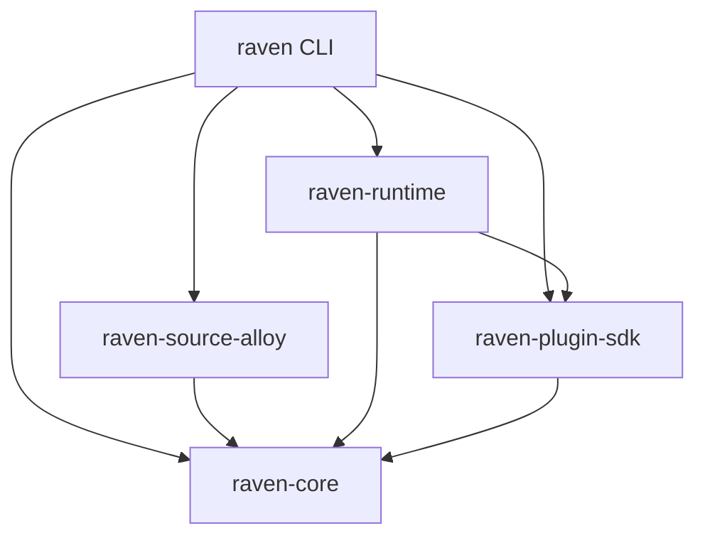
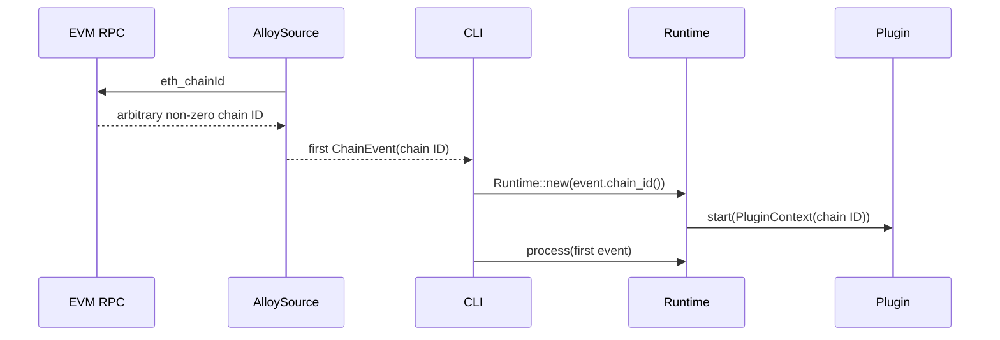
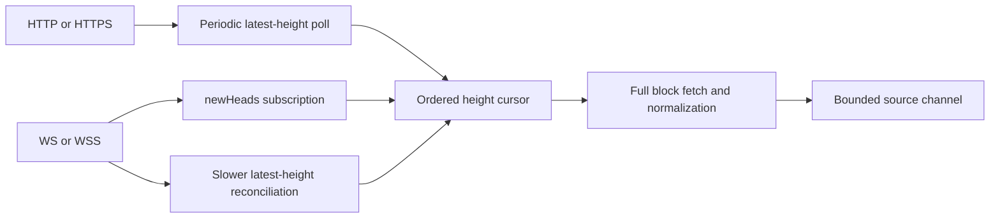
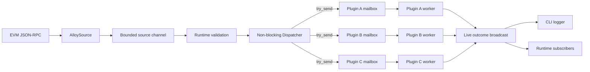
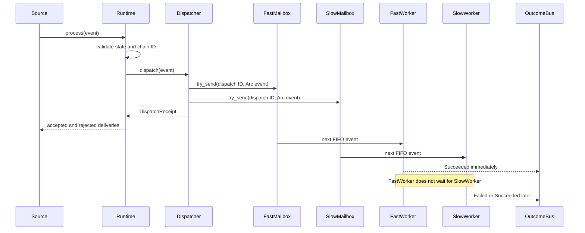
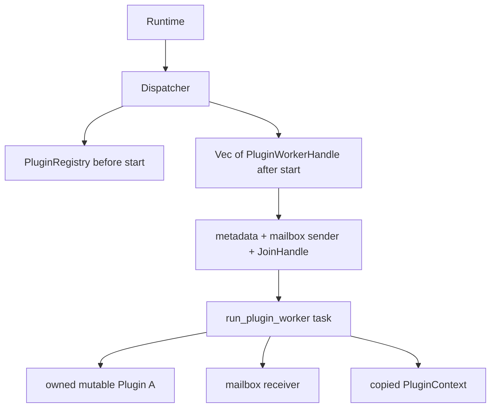

Raven is a source-independent EVM event runtime with an actor-style plugin
system. One source normalizes chain data once; the runtime then attempts to
enqueue each event into every plugin's independent worker mailbox.

The central dispatch rule is:

> A slow or failing plugin must not delay the delivery result or event outcome
> of another plugin.

## High-level design

### Workspace boundaries

Arrows mean "depends on":



| Layer | Responsibility | Does not own |
| --- | --- | --- |
| Source | Chain access, catch-up, and conversion into `ChainEvent` | Plugin behavior |
| Core | Validated, source-independent event values | Runtime control messages |
| Runtime | Chain validation, plugin lifecycle, mailboxes, dispatch, and outcomes | Protocol-specific application logic |
| Plugin SDK | The `Plugin` contract, context, metadata, and error vocabulary | Scheduling policy |
| Plugin | Stateful application behavior for normalized events | Shared chain ingestion |
| CLI | Config persistence, source/runtime composition, logging, Ctrl+C, and graceful shutdown | Reusable domain logic |

### Chain-agnostic runtime binding

Raven has no chain allowlist. The source discovers any non-zero EIP-155 chain
ID and includes it in every normalized event. The CLI creates the runtime only
after receiving the first event:



A runtime remains single-chain by design: after binding, it rejects events with
a different chain ID. This protects per-plugin ordering and state. Multi-chain
deployments currently run one Raven process per RPC endpoint.

### Transport-aware source ingestion

At the high level, transport affects how Raven learns that a new height exists;
it does not change event normalization or downstream dispatch:



HTTP(S) polls `eth_blockNumber` every four seconds by default. WS(S) uses
`eth_subscribe("newHeads")` for immediate signals and checks `eth_blockNumber`
every 30 seconds by default as a safety net. Subscription notifications are not
treated as a complete or durable event log.

At the low level, both paths update one monotonic `next_block_number` cursor:

```text
head notification or reconciliation returns target N
    └─► for height in next_block_number..=N
            ├─► eth_getBlockByNumber(height)
            ├─► convert to ChainEvent::BlockApplied
            ├─► send through bounded source channel
            └─► advance cursor
```

Subscribing before reading the initial height closes the startup race. Fetching
all heights through each target closes intermediate gaps when notifications are
coalesced or missed. Duplicate and stale notifications below the cursor are
ignored. Periodic reconciliation closes gaps across WebSocket lag or reconnect,
while Alloy owns transport reconnection and subscription restoration.

This monotonic cursor is not yet reorg-aware: a replacement block at an already
emitted height requires canonical ancestry tracking and `BlockReverted` events,
which remain planned.

### Runtime topology



Each plugin is an actor-like unit:

```text
Plugin worker = owned Box<dyn Plugin> + PluginContext + bounded FIFO mailbox
```

The plugin value and its mutable state never execute in two handlers at once.
Different workers are independent Tokio tasks and can make progress
concurrently.

<Note>
Tokio tasks provide concurrent scheduling; Raven does not create one operating
system thread per plugin. Async I/O naturally overlaps. A plugin doing
substantial CPU-bound or blocking work should move that work to
`tokio::task::spawn_blocking` or a dedicated compute pool so it does not occupy
an async executor thread.
</Note>

### Why a worker per plugin?

`join_all(plugin.handle_event(...))` would start handlers together, but the
caller would still wait for the slowest result. Spawning a new task for every
plugin and every event would also permit overlapping mutable calls inside one
plugin and lose its FIFO state model.

Long-lived workers provide all three required properties:

- Cross-plugin concurrency.
- Sequential, ordered access to each plugin's mutable state.
- A dispatch path that does not await plugin execution.

## Dispatch contract

Dispatch has two separate result stages. They must not be confused.

| Stage | API | Meaning | Waits for handler? |
| --- | --- | --- | --- |
| Delivery | `Runtime::process` returns `DispatchReceipt` | Each mailbox accepted or rejected the event | No |
| Execution | `Runtime::subscribe_outcomes` yields `PluginOutcome` | One plugin succeeded, failed, panicked, or rejected delivery | Independently, as it happens |

### Event sequence



`Runtime::process` is currently async for a stable orchestration API, but its
dispatch operation uses `try_send` and does not await any `handle_event` future.

### Immediate receipt

One monotonic `DispatchId` correlates the receipt and every later outcome.
`DispatchReceipt::deliveries` contains one entry for every worker:

- `Accepted`: the event entered that plugin's mailbox.
- `Rejected(MailboxFull)`: that plugin is slower than its bounded capacity.
- `Rejected(WorkerStopped)`: that worker was quarantined or otherwise stopped.

Raven attempts every plugin even when an earlier mailbox rejects the event.
Inspect `all_accepted`, `accepted_count`, and `rejected_count` when an upstream
source needs delivery metrics or policy decisions.

### Independent outcomes

An accepted event later emits exactly one live `PluginOutcome` during graceful
operation:

- `Succeeded`: `handle_event` returned `Ok(())`.
- `Failed(PluginError)`: the handler returned `Err`; the worker continues with
  its next event.
- `Panicked(String)`: Raven caught a handler panic and quarantined that worker.
- `Rejected(WorkerStopped)`: the event was already queued behind the event that
  panicked and could no longer run.

Dispatcher-side rejections also emit `Rejected` outcomes with zero handler
duration. Outcomes include the dispatch ID, plugin name, shared event, status,
and handler elapsed time.

The outcome channel is a live Tokio broadcast channel. A slow subscriber gets
`RecvError::Lagged` instead of backpressuring workers. Subscribe before
dispatching if all live outcomes matter. This channel is observability, not a
durable result store.

## Low-level design

### Ownership model



| Internal type | Important state | Role |
| --- | --- | --- |
| `Runtime` | `Dispatcher`, `PluginContext`, lifecycle state | Public orchestration boundary |
| `PluginRegistry` | Unique-name `Vec<Box<dyn Plugin>>` before startup | Reject duplicate identities |
| `Dispatcher` | Worker handles, capacities, next dispatch ID, outcome sender | Non-blocking fan-out and worker supervision |
| `PluginWorkerHandle` | Metadata, optional mailbox sender, `JoinHandle` | Control one independent worker |
| `QueuedPluginEvent` | `DispatchId` and `Arc<ChainEvent>` | Cheap fan-out without cloning event payloads |
| `PluginOutcome` | Correlation, plugin, event, status, duration | Independent execution report |

The worker task is the only owner that calls `start`, `handle_event`, or
`shutdown` on its plugin. This removes the need for a mutex around plugin
state.

### Router pseudocode

```text
dispatch(event):
    validate runtime state and event chain ID
    id = next DispatchId
    shared_event = Arc(event)

    for every worker:
        try_send(worker.mailbox, id + shared_event)
        record Accepted or explicit Rejected status

    return DispatchReceipt immediately
```

There is no `await` inside the per-worker delivery loop and rejection is not
fail-fast.

### Worker pseudocode

```text
worker(plugin, mailbox):
    await plugin.start(context)
    publish readiness to Runtime::start

    while queued event exists:
        await plugin.handle_event(event, context)
        publish that result immediately

        if handler panicked:
            close this mailbox
            reject already queued events as WorkerStopped
            stop this worker only

    await plugin.shutdown(context)
```

### Ordering and concurrency matrix

| Relationship | Guarantee |
| --- | --- |
| Events within one plugin | FIFO; never overlap |
| The same event across plugins | Concurrent; completion order is unspecified |
| Receipts across calls to `process` | Monotonic dispatch IDs in call order |
| Outcomes across plugins | Emitted in actual completion order |
| Outcomes within one healthy plugin | Match that plugin's FIFO processing order |

### What per-plugin ordering means

Suppose Raven dispatches three accepted events in this order:

```text
E1 -> E2 -> E3
```

Each plugin observes that order independently:

```text
Plugin A mailbox: E1 -> E2 -> E3
Plugin B mailbox: E1 -> E2 -> E3
```

Raven never calls `Plugin A::handle_event(E2)` before Plugin A finishes
`handle_event(E1)`, and it never runs two Plugin A handlers at the same time.
This is what protects Plugin A's mutable state and makes its state transitions
predictable. The same rule applies separately to Plugin B.

It is **not** a global barrier between plugins. This completion timeline is
valid:

```text
time -------------------------------------------------------------->

Plugin A: [---------- E1 ----------][--- E2 ---][E3]
Plugin B: [- E1 -][- E2 -][- E3 -]

outcomes: B:E1, B:E2, B:E3, A:E1, A:E2, A:E3
```

Plugin B may therefore finish E2 or E3 while Plugin A is still handling E1.
Plugin B only waits for its own previous event, never for Plugin A.

The FIFO guarantee applies to events that the mailbox accepted. An event
rejected with `MailboxFull` never entered that plugin's queue, so it cannot be
part of that plugin's processed sequence. If a worker panics, its queued events
are explicitly reported as `Rejected(WorkerStopped)` rather than silently
reordered or skipped.

Code that requires Plugin B to observe Plugin A's output should use an explicit
dependency or message flow. Registration order is not an execution dependency.

## Backpressure and overload

Each plugin mailbox is bounded. The default capacity is
`DEFAULT_PLUGIN_MAILBOX_CAPACITY` (`256`), and
`Runtime::with_plugin_mailbox_capacity` can choose another positive capacity.

```text
Fast plugin: event -> mailbox -> handle -> outcome

Slow plugin: event -> [queued, queued, ... full]
                         next event -> Rejected(MailboxFull)

Other plugins continue accepting and processing the same event.
```

A bounded queue prevents one unhealthy plugin from consuming unbounded memory.
Non-blocking dispatch means Raven cannot also guarantee that every overloaded
mailbox accepts every event. Durable at-least-once delivery requires a replay
log/checkpoint design and remains roadmap work.

## Lifecycle barriers

Event handling is independent, while process-wide lifecycle transitions are
intentional barriers:

- **Start:** Raven spawns every worker first, so startup hooks run concurrently.
  `Runtime::start` returns only after all workers report readiness. If any
  startup fails, Raven closes all worker mailboxes and waits for started
  siblings to shut down.
- **Dispatch:** No global barrier. Delivery returns immediately and outcomes
  stream independently.
- **Shutdown:** Raven drops all mailbox senders first. Workers concurrently
  drain already accepted FIFO events and call `shutdown`. `Runtime::shutdown`
  waits for every worker so resources are not abandoned.

Startup/shutdown timeouts and worker restart policy are not implemented yet.

## Failure isolation

| Failure | Scope | Other plugins | This worker |
| --- | --- | --- | --- |
| Handler returns `Err` | One plugin and one event | Continue normally | Emits `Failed`, then continues |
| Handler panics | One plugin worker | Continue normally | Emits `Panicked`, closes mailbox, rejects queued work, then shuts down |
| Mailbox is full | One plugin delivery | Other mailboxes are still attempted | Emits `Rejected(MailboxFull)` |
| Outcome subscriber lags | One subscriber | Workers never wait | Subscriber receives `Lagged` |
| Startup fails | Global readiness barrier | Started siblings are cleaned up | Runtime does not enter `Started` |
| Shutdown fails | Global shutdown result | Every worker is still joined | Runtime enters `Shutdown` and returns an error |

Handler errors are expected operational results. Panics indicate broken plugin
invariants, so continuing with possibly corrupted plugin state would be unsafe.

## Guarantees and non-guarantees

Raven currently guarantees:

- Every dispatch attempts every active plugin mailbox.
- One slow, failing, full, or panicked plugin does not block sibling event work.
- Per-plugin FIFO processing with no overlapping mutable handler calls.
- Immediate delivery receipts and independently timed live outcomes.
- Graceful shutdown drains accepted events before plugin cleanup.

Raven does not yet guarantee:

- Durable delivery across process crashes or subscriber lag.
- Automatic retries, worker restarts, handler timeouts, or dead-letter queues.
- A deterministic completion order across plugins.
- CPU parallelism for blocking work performed directly inside async handlers.

## Stability boundary

The normalized core model remains the boundary between adapters and
applications. A new source converts into `ChainEvent`; a new application
implements `Plugin`. Neither should depend on the other.

Raven does not expose a shared source trait yet. The adapter contract is still
behavioral: produce validated events through a bounded channel. A second source
such as Reth ExEx should prove the common interface before Raven commits to it.
