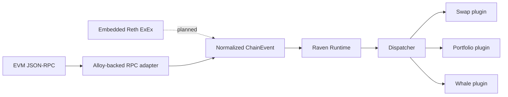

Raven is a **source-independent EVM event runtime with a plugin system**. It
sits between chain-data adapters and application logic:



Only the RPC path and generic plugin dispatch exist today. The Reth adapter and
example domain plugins in the diagram are planned.

## What Raven is

- A runtime that owns plugin registration, lifecycle, validation, and dispatch.
- A normalization boundary between source-native chain data and applications.
- A plugin system for reusable monitoring, analytics, indexing, automation, and
  notification behavior.
- An integration point for multiple EVM data sources over time.

## What Raven is not

- A blockchain node.
- A replacement for Alloy or another RPC client.
- A complete indexer with storage and query APIs.
- A dynamic plugin marketplace today.

Those systems can connect to Raven, but they are not all responsibilities of
the runtime itself.

## One chain stream, many plugins

Plugins should not independently repeat chain ingestion:

```text
Avoid:   RPC ─┬─► Plugin A polls blocks
             ├─► Plugin B polls blocks
             └─► Plugin C polls blocks

Prefer:  RPC ─► Source ─► ChainEvent ─► Runtime ─┬─► Plugin A
                                                ├─► Plugin B
                                                └─► Plugin C
```

The source owns chain access and normalization. Plugins receive the same event
stream and focus on application behavior. A plugin may still create clients for
non-chain services such as a database or notification provider.

## Boundary rules

| Boundary | Rule | Current enforcement |
| --- | --- | --- |
| Source | Convert source-native data into `ChainEvent` | Implemented for JSON-RPC by `raven-source-alloy` |
| Core | Prevent invalid normalized values from entering the runtime | Constructors, private fields, and validated deserialization |
| Runtime | Accept events for exactly one EIP-155 chain ID | Checked before every dispatch |
| Dispatcher | Attempt non-blocking fan-out to every plugin worker | Independent bounded mailboxes and live outcomes |
| Plugin | Depend on normalized events, not a specific source | Enforced by the `Plugin` trait API |
| CLI | Compose ingestion, runtime, and configured plugins | JSON-RPC plus a built-in block logger today |

The source ownership rule is an architectural contract rather than a sandbox:
Rust cannot prevent a plugin from opening its own RPC connection. Reviews and
plugin APIs should keep chain ingestion in source crates.

## Events are data; shutdown is lifecycle

Chain events describe changes observed from the chain. Runtime shutdown is a
lifecycle action, so it belongs in `Plugin::shutdown`, not in `ChainEvent`.
Likewise, storage, retries, and dispatch concurrency are runtime or adapter
policies rather than event variants.

This separation keeps the core event model serializable and replayable without
mixing operational control messages into chain history.

## Independence without unbounded work

Each plugin owns one FIFO mailbox and one Tokio task. Different plugins run
concurrently; events inside a plugin stay sequential so its mutable state does
not need a shared lock. `Runtime::process` reports mailbox acceptance without
waiting for handlers, and live outcomes arrive in completion order.

The mailbox is bounded because isolation also means containing an unhealthy
plugin's memory usage. When one mailbox is full, only that delivery is rejected;
every sibling mailbox is still attempted. Durable lossless delivery requires a
separate replay/checkpoint contract rather than an unbounded in-memory queue.

## Add the right extension

Use a **source adapter** when the input mechanism changes, for example JSON-RPC
ingestion versus Reth ExEx notifications. Use a **plugin** when application
behavior changes, for example detecting a large ERC-20 transfer or delivering
an alert.

Both extension types meet at `ChainEvent`. A second production source should be
built before extracting a shared source trait; two real adapters will reveal
the interface Raven actually needs.
