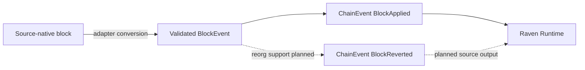

## Chain ID

`ChainId` wraps an EIP-155 numeric chain ID. Every non-zero `u64` is accepted;
named constants such as `ETHEREUM` are conveniences rather than a supported-chain
allowlist.

```rust
use raven_core::ChainId;

let chain = ChainId::new(8_453)?;
assert_eq!(chain.get(), 8_453);
```

## Block event

`BlockEvent` stores source-independent block metadata:

| Field | Type | Meaning |
| --- | --- | --- |
| `chain_id` | `ChainId` | EIP-155 chain ID |
| `block_number` | `u64` | Block height |
| `block_hash` | `String` | 32-byte, `0x`-prefixed hexadecimal hash |
| `parent_hash` | `String` | Parent hash in the same format |
| `timestamp` | `u64` | Unix timestamp in seconds |
| `transaction_count` | `u64` | Transactions in the block |

`BlockEvent::new` validates both hashes. For a non-genesis block, the block and
parent hashes must differ. Fields are private and exposed through accessors such
as `block_hash()` and `transaction_count()`, so construction cannot bypass
validation.

## Chain event

The current event enum has two variants:

```rust
pub enum ChainEvent {
    BlockApplied(BlockEvent),
    BlockReverted(BlockEvent),
}
```

`BlockApplied` means a block joined the canonical chain. `BlockReverted` means a
previously applied block left the canonical chain.

Convenience methods expose common metadata without matching the enum:

```rust
let block = event.block();
let chain_id = event.chain_id();
let number = event.block_number();

if event.is_applied() {
    // Process a canonical block.
}
```

<Note>
The model supports reverted blocks, but the Alloy source currently emits only
`BlockApplied`. Reorg detection is on the roadmap.
</Note>

## Event boundary



Transactions, logs, transfers, swaps, and other domain events are possible
extensions, but they are not current `ChainEvent` variants. Runtime shutdown is
a plugin lifecycle action and should remain outside the serializable chain-event
model.

## Serialization

Core event types support Serde serialization and validated deserialization.
Deserializing a zero chain ID, malformed hash, or identical non-genesis block
and parent hash returns an error. `ChainEvent` uses an internally tagged shape
with snake-case variant names:

```json
{
  "type": "block_applied",
  "data": {
    "chain_id": 8453,
    "block_number": 21000000,
    "block_hash": "0x1111111111111111111111111111111111111111111111111111111111111111",
    "parent_hash": "0x2222222222222222222222222222222222222222222222222222222222222222",
    "timestamp": 1720000000,
    "transaction_count": 150
  }
}
```
