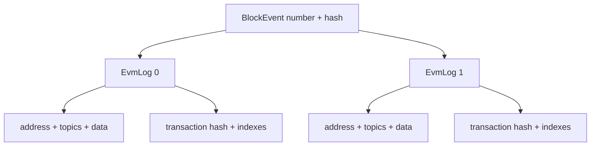
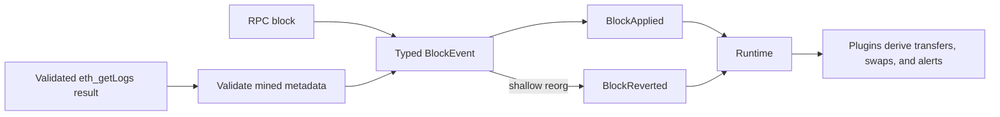

## Chain ID

`ChainId` wraps an EIP-155 numeric chain ID. Every non-zero `u64` is accepted;
named constants such as `ETHEREUM` are conveniences rather than a supported-chain
allowlist.

```rust
use raven_core::ChainId;

let chain = ChainId::new(8_453)?;
assert_eq!(chain.get(), 8_453);
```

## Block event

`BlockEvent` is the block-atomic payload delivered to plugins:

| Field | Type | Meaning |
| --- | --- | --- |
| `chain_id` | `ChainId` | EIP-155 chain ID |
| `block_number` | `u64` | Block height |
| `block_hash` | `B256` | Typed 32-byte block hash |
| `parent_hash` | `B256` | Typed 32-byte parent hash |
| `timestamp` | `u64` | Unix timestamp in seconds |
| `transaction_count` | `u64` | Transactions in the block |
| `logs` | `Vec<EvmLog>` | Mined logs in deterministic block order |

`BlockEvent::new` creates metadata-only test or adapter values.
`BlockEvent::new_with_logs` also validates that every log refers to an existing
transaction and that positions are strictly ordered by transaction index and
log index. For a non-genesis block, the block and parent hashes must differ.

Block hashes are `alloy_primitives::B256`, so callers cannot construct a short
or non-hex hash and defer failure until runtime. Their human-readable Serde form
remains a `0x`-prefixed 32-byte hexadecimal string.

## EVM log

`EvmLog` contains only mined log data a plugin can consume without an RPC call:

| Field | Type | Meaning |
| --- | --- | --- |
| `address` | `Address` | Smart contract that emitted the log |
| `topics` | `Vec<B256>` | Zero to four indexed EVM topics |
| `data` | `Bytes` | ABI-encoded non-indexed event data |
| `transaction_hash` | `B256` | Transaction that emitted the log |
| `transaction_index` | `u64` | Transaction position in the block |
| `log_index` | `u64` | Log position across the block |

Block identity is not duplicated in every log. The enclosing `BlockEvent`
supplies the number and hash, and Alloy conversion rejects an RPC log whose
block metadata disagrees with that envelope.



## Chain event

The event enum remains block-atomic:

```rust
pub enum ChainEvent {
    BlockApplied(BlockEvent),
    BlockReverted(BlockEvent),
}
```

`BlockApplied` means a block joined the canonical chain. `BlockReverted` means a
previously applied block left the canonical chain. Keeping logs inside this
envelope means one event is still one checkpoint transition.

```text
apply block B with logs [L1, L2]
              |
              v shallow reorg
revert block B with the same logs [L1, L2]
              |
              v
plugin retracts or corrects observations derived from L1 and L2
```

Convenience methods expose common metadata without matching the enum:

```rust
let block = event.block();
let logs = block.logs();

if event.is_applied() {
    // Add observations derived from this canonical block.
} else {
    // Correct observations derived from the reverted block.
}
```

The RPC source emits retained old blocks from tip toward the common ancestor,
then replacement blocks in ascending order. Forks deeper than the configured
window are terminal.

## Source and plugin boundary



Logs are generic core payloads. ERC-20 transfers, DEX swaps, and other
protocol-specific meanings remain derived plugin behavior rather than new core
variants. Runtime shutdown remains a lifecycle action outside the serializable
chain-event model.

## Serialization

Core event types support Serde serialization and validation-preserving
deserialization. Existing metadata-only JSON without `logs` remains compatible
and deserializes to an empty log list. New events serialize logs in the block:

```json
{
  "type": "block_applied",
  "data": {
    "chain_id": 8453,
    "block_number": 21000000,
    "block_hash": "0x1111111111111111111111111111111111111111111111111111111111111111",
    "parent_hash": "0x2222222222222222222222222222222222222222222222222222222222222222",
    "timestamp": 1720000000,
    "transaction_count": 1,
    "logs": [
      {
        "address": "0x3333333333333333333333333333333333333333",
        "topics": [
          "0x4444444444444444444444444444444444444444444444444444444444444444"
        ],
        "data": "0x",
        "transaction_hash": "0x5555555555555555555555555555555555555555555555555555555555555555",
        "transaction_index": 0,
        "log_index": 0
      }
    ]
  }
}
```

Standalone `ChainEvent` JSON is an interchange shape, not yet a durable replay
format. The current CLI checkpoint wraps its nested block payloads in
`schema_version`; an incompatible layout or semantic change requires a
checkpoint version bump and an explicit compatibility or migration path.
Future event stores and replay APIs must likewise add a versioned envelope
rather than treating the bare Serde representation as permanently stable.
