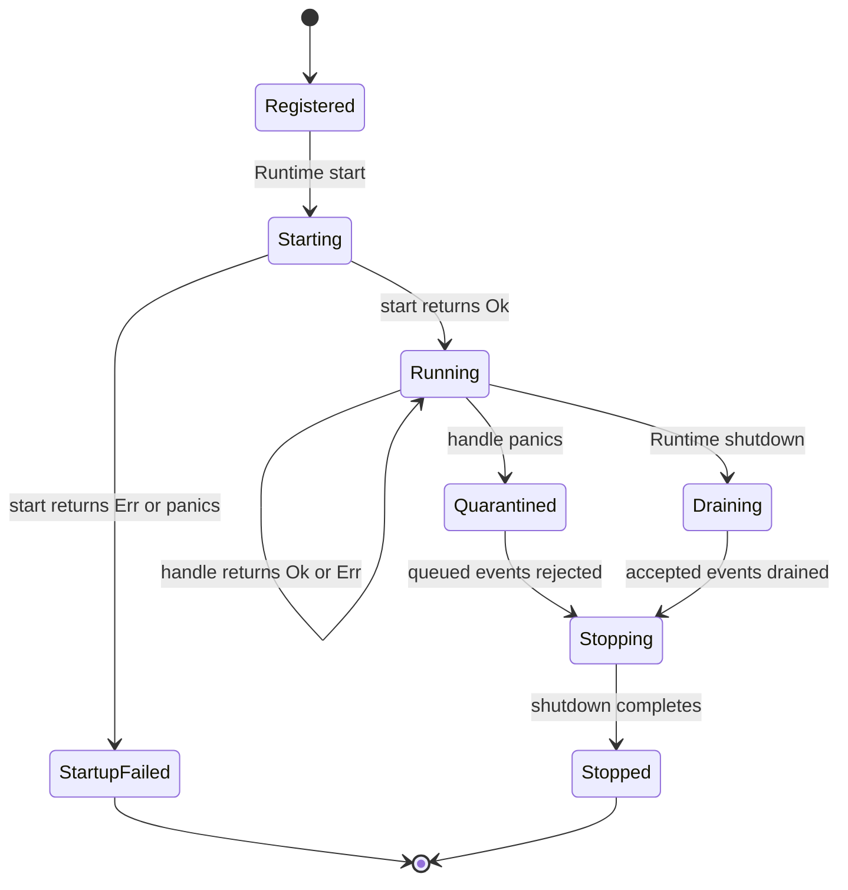
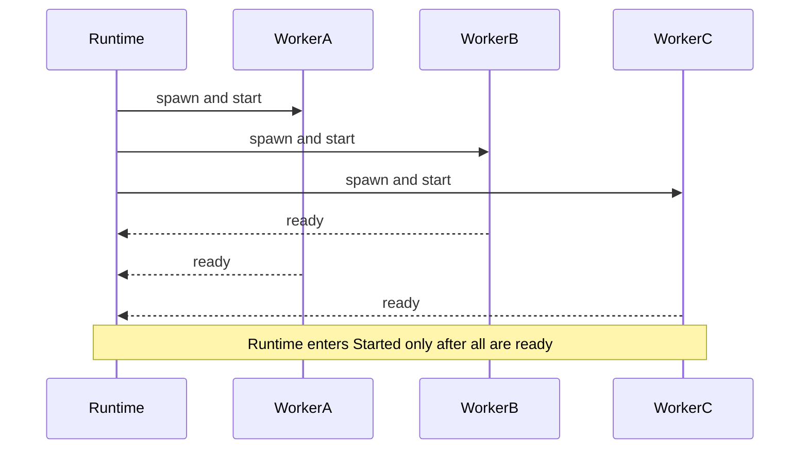

Each registered plugin becomes one long-lived worker with exclusive ownership
of the plugin value and a bounded FIFO mailbox.



## Registration

Register plugins before calling `Runtime::start`:

```rust
let mut runtime = Runtime::new(ChainId::ETHEREUM);
runtime.register_plugin(MyPlugin)?;
runtime.start().await?;
```

Names returned by `Plugin::metadata` must be unique inside a runtime.
Registration after startup returns `RuntimeError::RegistrationAfterStart`.

At this point the `PluginRegistry` owns the plugin. No worker exists and no
lifecycle hook has run.

## Concurrent startup

`Runtime::start` moves every plugin into its own Tokio task before waiting for
readiness. All `start` hooks can therefore overlap.



Startup is intentionally a global barrier: dispatch cannot begin against a
partially ready plugin set. If any startup returns `Err` or panics, Raven closes
all mailboxes, waits for workers that did start to shut down, marks the runtime
as shut down, and returns the startup error.

The default `start` implementation succeeds immediately. Override it for
configuration validation and external-client initialization.

## Independent event handling

Once started, `Runtime::process` validates the event and attempts a non-blocking
send to every worker mailbox. It returns a `DispatchReceipt`; it does not wait
for `handle_event`.

Each worker independently repeats:

```text
receive oldest queued event
    -> await handle_event
    -> emit PluginOutcome immediately
    -> receive next event
```

This yields two useful properties at once:

- One plugin's events remain ordered and never execute concurrently against its
  mutable state.
- Different plugins execute independently, so a fast plugin can report success
  while another plugin is still awaiting I/O.

See [Architecture](/docs/concepts/architecture) for receipts, outcomes,
backpressure, the precise meaning of per-plugin FIFO ordering, and the complete
HLD/LLD.

## Handler errors

Returning `PluginError` is a normal, recoverable event outcome:

```text
Plugin A returns Err -> emit Failed(A) -> Plugin A receives its next event
Plugin B still runs  -> emit its own result whenever it completes
```

The error does not return from another plugin's work, stop the source loop, or
cancel sibling workers. Subscribers receive it immediately as
`PluginOutcomeStatus::Failed` with the plugin name, dispatch ID, event, and
elapsed handler time.

Use the closest error category: invalid configuration, event processing,
storage, or `Other`.

## Panic quarantine

A panic is different from a returned error because the plugin's mutable state
may no longer satisfy its invariants. Raven catches handler panics at the worker
boundary and quarantines only that plugin:

1. Close that worker's mailbox.
2. Emit `Panicked` for the current event.
3. Emit `Rejected(WorkerStopped)` for already queued events.
4. Run the plugin's `shutdown` hook.
5. Reject future dispatches to that worker as `WorkerStopped`.

Other workers remain active. Automatic restart is intentionally deferred until
plugins have an explicit state-recovery contract.

## Backpressure state

While a worker is running, its mailbox can still be full. The event is rejected
for that plugin with `MailboxFull`; the dispatcher continues trying every other
worker. A full mailbox does not change lifecycle state.

Choose capacity with `Runtime::with_plugin_mailbox_capacity`. Capacity must be
greater than zero. Queue sizing is a latency/memory tradeoff, not a substitute
for durable replay.

## Graceful shutdown

`Runtime::shutdown` is a global cleanup barrier but workers still make progress
independently:

```text
Runtime drops every sender
    ├─> Worker A drains A queue -> shutdown A
    ├─> Worker B drains B queue -> shutdown B
    └─> Worker C drains C queue -> shutdown C

Runtime waits for A + B + C, then returns
```

All senders are closed before Raven awaits any `JoinHandle`, so awaiting the
first handle does not serialize worker execution. Raven records the first
shutdown failure but still joins every worker. The runtime transitions to
`Shutdown` whether cleanup succeeds or returns an error.

The CLI calls this path after Ctrl+C or when the source stops. A process crash
or forced Tokio-runtime termination cannot provide the same drain guarantee.

## Lifecycle policy summary

| Phase | Cross-plugin scheduling | Caller waits? | Failure scope |
| --- | --- | --- | --- |
| Registration | Not running | No | Invalid registration only |
| Startup | Concurrent tasks | Yes, readiness barrier | Startup aborts the runtime and cleans up siblings |
| Dispatch delivery | Non-blocking `try_send` | No handler wait | Rejection belongs to one plugin |
| Event execution | Concurrent across workers, FIFO within one worker | Observed through live outcomes | Returned error affects one event; panic quarantines one worker |
| Shutdown | Concurrent drain and cleanup | Yes, cleanup barrier | All workers are joined before an error returns |

Per-hook timeouts, multi-error aggregation, health APIs, restart supervision,
and durable dead-letter handling remain planned reliability work.
