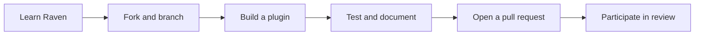

The shortest contribution path is to learn Raven's event and plugin model, add
a focused plugin, prove its behavior with tests, and submit a pull request.



## 1. Learn Raven first

Read the existing documentation instead of learning the architecture through a
plugin implementation:

- [Architecture](/docs/concepts/architecture) explains the source, runtime,
  and plugin boundaries.
- [Events](/docs/concepts/events) describes the normalized data delivered to
  plugins.
- [Plugin lifecycle](/docs/concepts/plugin-lifecycle) covers registration,
  event handling, outcomes, and shutdown.
- [Runtime reference](/docs/reference/runtime) provides the complete runtime
  flow on one page.

Then use [Create a plugin](/docs/guides/create-a-plugin) as the implementation
guide and the [ERC-20 transfer plugin](/docs/plugins/erc20-transfer) as a
complete example.

## 2. Fork and create a branch

Fork `abhi3700/raven` on GitHub, clone your fork, and create a focused branch:

```bash
git clone https://github.com/YOUR_GITHUB_USER/raven.git
cd raven
git remote add upstream https://github.com/abhi3700/raven.git
git checkout -b feat/YOUR_PLUGIN
```

## 3. Create the plugin

Each public plugin is an individual crate under `crates/plugins/`:

```text
crates/plugins/YOUR_PLUGIN/
├── Cargo.toml
└── src/
    └── lib.rs
```

Use `raven-plugin-YOUR_PLUGIN` as the Cargo package name. The workspace's
`crates/plugins/*` member discovers the crate automatically.

Define the plugin struct and implement `Plugin`. `metadata` and `handle_event`
are required; `start` and `shutdown` are optional lifecycle hooks.

```rust
use async_trait::async_trait;
use raven_core::ChainEvent;
use raven_plugin_sdk::{
    Plugin, PluginContext, PluginMetadata, PluginResult,
};

pub struct MyPlugin;

#[async_trait]
impl Plugin for MyPlugin {
    fn metadata(&self) -> PluginMetadata {
        PluginMetadata::new(
            "my-plugin",
            env!("CARGO_PKG_VERSION"),
            "Describes what the plugin observes or does",
        )
    }

    async fn handle_event(
        &mut self,
        event: &ChainEvent,
        context: &PluginContext,
    ) -> PluginResult {
        // Match normalized events and update plugin-owned state here.
        let _ = (event, context);
        Ok(())
    }
}
```

Keep provider-specific RPC types outside the plugin when the normalized
`ChainEvent` already contains the required data.

## 4. Write tests

Construct events directly and call `handle_event`; unit tests should not need a
live node. Cover the behavior relevant to the plugin, including:

- Matching and non-matching events
- Applied and reverted blocks when observations depend on chain state
- Thresholds, filters, malformed input, and error paths
- State changes and emitted observations

Run the plugin's tests while iterating:

```bash
cargo test -p raven-plugin-YOUR_PLUGIN
```

The [ERC-20 transfer source](https://github.com/abhi3700/raven/tree/main/crates/plugins/erc20-transfer)
shows the plugin struct, trait implementation, fixtures, and deterministic tests
together.

## 5. Document and validate

Add `docs/plugins/YOUR_PLUGIN.mdx` and register it in the **Plugins** group in
`docs.json`. Document only implemented behavior and label planned behavior
explicitly.

Before opening a pull request, run:

```bash
cargo fmt --all -- --check
cargo test --workspace --all-targets
cargo clippy --workspace --all-targets -- -D warnings
mint validate
mint broken-links
```

## 6. Submit and participate in review

Push the branch and open a pull request against Raven's default branch. Explain
what the plugin does, why it belongs in Raven, and which tests and validation
commands you ran.

After submission, wait for review and respond when maintainers leave comments.
Discuss unclear requests, push follow-up code, tests, or documentation, and keep
the pull request current until the review is resolved.
