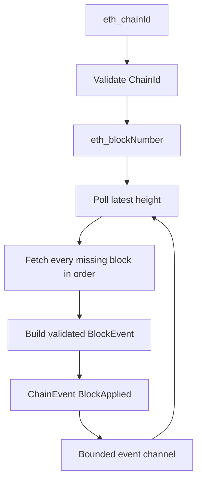

`AlloySource` is Raven's current chain adapter. It works with standard HTTP
Ethereum JSON-RPC endpoints and publishes normalized events through a bounded
Tokio channel.

## Polling flow



The source uses polling instead of filter APIs such as `eth_newBlockFilter`
because public HTTP providers support filters inconsistently.

## Catch-up behavior

At startup, the source records the latest block height as the next block to
fetch. On each poll it fetches every height through the newest observed height,
in ascending order.

For example, if the next height is 100 and the following poll observes 103,
Raven requests and emits blocks 100, 101, 102, and 103.

## Configure the source in Rust

```rust
use std::time::Duration;

use raven_source_alloy::AlloySource;
use tokio::sync::mpsc;

let (sender, mut receiver) = mpsc::channel(256);

let source = AlloySource::new("http://localhost:8545")
    .with_poll_interval(Duration::from_secs(1));

tokio::spawn(async move {
    source.run(sender).await
});

while let Some(event) = receiver.recv().await {
    println!("received block {}", event.block_number());
}
```

`AlloySource::run` rejects a zero polling interval before connecting. The CLI
also validates `--poll-interval-ms` as greater than zero.

## Failure behavior

`AlloySource::run` stops and returns an error when:

- It cannot connect to the RPC endpoint.
- Chain ID or block-number requests fail.
- The provider omits a requested block.
- A block cannot be normalized.
- The event receiver is dropped.

## Current limitations

- Only HTTP JSON-RPC is configured by the source.
- Historical blocks before the startup height are not backfilled.
- Reorganizations are not detected.
- `BlockReverted` is never emitted by this source.
- Retry and exponential backoff policies are not yet implemented.
