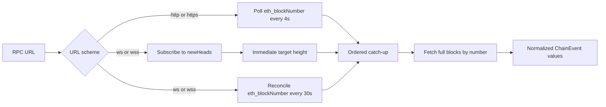
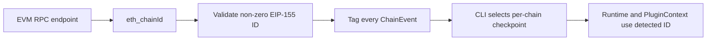

`AlloySource` is the internal adapter behind `raven run`. It connects to
EVM-compatible HTTP(S) and WS(S) JSON-RPC endpoints, fetches full blocks,
converts them into normalized `ChainEvent` values, and publishes them through a
bounded Tokio channel.

The CLI does not expose `--source alloy`: Alloy is the implementation of the
current RPC path, not an operator-selected deployment mode. The endpoint may be
hosted or self-managed; the URL scheme selects the transport behavior.

## Production strategy

Raven chooses the ingestion strategy from the URL scheme:



HTTP is request/response transport, so periodic polling is the portable
choice. A WebSocket is persistent and supports `eth_subscribe`, so Raven uses
`newHeads` for low-latency signals rather than polling every few seconds as its
primary mechanism.

Raven deliberately does not use a subscription alone. JSON-RPC subscriptions
deliver current events rather than history, are tied to a live connection, and
may omit intermediate notifications when several blocks arrive close together.
A slower `eth_blockNumber` reconciliation therefore provides a correctness
safety net without turning WebSocket operation back into aggressive polling.

See Alloy's
[block subscription example](https://alloy.rs/examples/subscriptions/subscribe_blocks/)
and Geth's
[subscription considerations](https://geth.ethereum.org/docs/interacting-with-geth/rpc/pubsub)
for the underlying transport behavior.

## Chain discovery

The endpoint, not a compile-time constant, selects the chain:



`ChainId` accepts every non-zero `u64`; Raven does not compare the discovered
value against a supported-chain list. Alloy's default Ethereum network type is
the baseline RPC block schema used by EVM chains—it does not force chain ID 1.
An endpoint must provide the standard `eth_chainId`, `eth_blockNumber`, and
`eth_getBlockByNumber` methods, plus `eth_subscribe` when using WS(S).

## One canonical catch-up path

Both triggers feed the same cursor-based algorithm:

```text
observed target height N
        │
        ▼
compare bounded retained ancestry with canonical RPC blocks
        │
        ├─ fork ─► revert old tip down to common ancestor
        │
        ▼
fetch every replacement/missing height through N
        │
        ▼
verify parent links, emit Applied, retain bounded ancestry
```

A WebSocket header is only a signal that a height is available. Raven does not
publish the partial header as its block event. It requests every full block
from the cursor through the signalled height using `eth_getBlockByNumber`.

For example, if Raven's next height is 100 and it observes head 103, it emits
100, 101, 102, and 103 in ascending order. A duplicate or stale notification
below the cursor causes an ancestry check. The same behavior applies when the
periodic reconciliation discovers a gap.

At startup Raven subscribes before reading the current height, preventing a
block mined during initialization from falling between those operations. It
then emits the configured start position through the current head. Raven owns
reconnection so the same in-memory cursor/window survives a new provider and
subscription; reconciliation then closes the gap.

<Note>
    A shallow fork emits old blocks in descending `BlockReverted` order, then
    replacement blocks in ascending `BlockApplied` order. A fork with no common
    ancestor in the retained window is terminal rather than silently skipping
    a correction. The default window is 64 blocks.
</Note>

## Start positions and durable resume

`SourceStart` supports:

- `Latest`: emit the current head and follow it.
- `Block(N)`: emit block `N` inclusively and catch up.
- `Resume(blocks)`: verify a contiguous, parent-linked durable ancestry window
  and continue after its tip.

The source's cursor is optimistic in-memory state. The `raven` CLI owns the
durable checkpoint and advances it only after all plugins succeed. This split
means a crash can replay an event but cannot silently acknowledge one that a
plugin did not finish.

## Configure the source in Rust

HTTP example:

```rust
use std::time::Duration;

use raven_source_alloy::{AlloySource, SourceStart};
use tokio::sync::mpsc;

let (sender, mut receiver) = mpsc::channel(256);

let source = AlloySource::new("http://localhost:8545")
    .with_poll_interval(Duration::from_secs(1))
    .with_start(SourceStart::Block(20_000_000))
    .with_reorg_depth(64);

tokio::spawn(async move {
    source.run(sender).await
});

while let Some(event) = receiver.recv().await {
    println!("received block {}", event.block_number());
}
```

WebSocket example:

```rust
use std::time::Duration;

use raven_source_alloy::AlloySource;

let source = AlloySource::new("wss://your-evm-rpc.example")
    .with_reconciliation_interval(Duration::from_secs(30));
```

The default HTTP poll interval is 4 seconds. The default WS reconciliation
interval is 30 seconds. The default reorg window is 64 blocks. Source
configuration rejects zero intervals/depth, malformed resume windows, and an
invalid retry policy before processing events.

## Failure behavior

`AlloySourceError::is_transient` separates retryable transport/state failures
from terminal contract violations.

Transient failures include connection/request/subscription errors, a closed
subscription, a temporarily omitted block, and the chain changing during a
multi-block reconciliation. Raven reconnects with exponential backoff starting
at 500 ms, capped at 30 seconds, with 20% jitter. Every retry logs its attempt,
delay, and cause.

Terminal failures include an invalid URL/configuration, invalid chain ID,
resume checkpoint mismatch, block conversion failure, receiver loss, and a
reorg deeper than retained ancestry. Terminal failures stop the source rather
than retrying a condition that cannot be repaired by reconnecting.

## Current limitations

- Reorg recovery is intentionally bounded; deep forks require operator action
  and a deliberate new start position.
- The source does not persist state by itself. Embedders other than the Raven
  CLI must own their acknowledgement/checkpoint contract.
- JSON-RPC providers may differ in retention and EVM compatibility, so explicit
  historical starts can fail when the endpoint has pruned the requested data.
