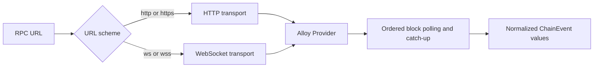
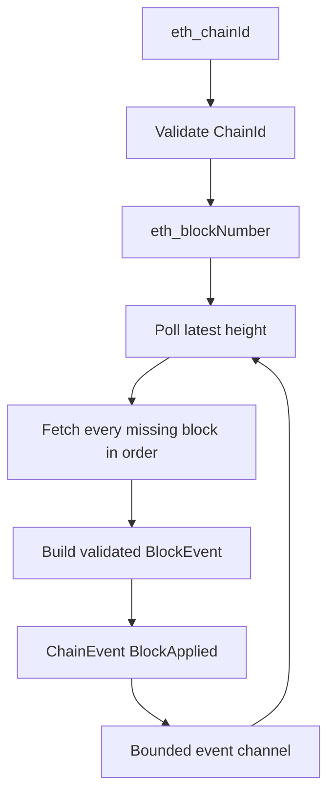

`AlloySource` is Raven's current chain adapter. It works with standard HTTP(S)
and WebSocket (WS/WSS) Ethereum JSON-RPC endpoints and publishes normalized
events through a bounded Tokio channel.

## Transport selection

Alloy selects the transport from the endpoint scheme. Raven keeps one source
contract and one polling algorithm across both transports:



WebSocket support establishes a persistent WS/WSS JSON-RPC connection, but the
source intentionally continues calling `eth_blockNumber` and
`eth_getBlockByNumber`. It does not currently switch to `eth_subscribe`, so
ordering and missed-block catch-up behave identically across transports.

## Polling flow



The source uses polling instead of filter or subscription APIs because public
providers support them inconsistently.

## Catch-up behavior

At startup, the source records the latest block height as the next block to
fetch. On each poll it fetches every height through the newest observed height,
in ascending order.

For example, if the next height is 100 and the following poll observes 103,
Raven requests and emits blocks 100, 101, 102, and 103.

## Configure the source in Rust

```rust
use std::time::Duration;

use raven_source_alloy::AlloySource;
use tokio::sync::mpsc;

let (sender, mut receiver) = mpsc::channel(256);

let source = AlloySource::new("http://localhost:8545")
    .with_poll_interval(Duration::from_secs(1));

tokio::spawn(async move {
    source.run(sender).await
});

while let Some(event) = receiver.recv().await {
    println!("received block {}", event.block_number());
}
```

Replace the constructor URL with `ws://...` or `wss://...` to use WebSocket;
the remaining source code is unchanged.

`AlloySource::run` rejects a zero polling interval before connecting. The CLI
also validates `--poll-interval-ms` as greater than zero.

## Failure behavior

`AlloySource::run` stops and returns an error when:

- It cannot connect to the RPC endpoint.
- Chain ID or block-number requests fail.
- The provider omits a requested block.
- A block cannot be normalized.
- The event receiver is dropped.

## Current limitations

- Historical blocks before the startup height are not backfilled.
- Reorganizations are not detected.
- `BlockReverted` is never emitted by this source.
- Retry and exponential backoff policies are not yet implemented.
