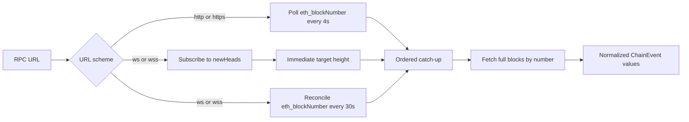

`AlloySource` is Raven's current chain adapter. It connects to Ethereum-compatible
HTTP(S) and WS(S) JSON-RPC endpoints, fetches full blocks, converts them into
normalized `ChainEvent` values, and publishes them through a bounded Tokio
channel.

## Production strategy

Raven chooses the ingestion strategy from the URL scheme:



HTTP is request/response transport, so periodic polling is the portable
choice. A WebSocket is persistent and supports `eth_subscribe`, so Raven uses
`newHeads` for low-latency signals rather than polling every few seconds as its
primary mechanism.

Raven deliberately does not use a subscription alone. Ethereum subscriptions
deliver current events rather than history, are tied to a live connection, and
may omit intermediate notifications when several blocks arrive close together.
A slower `eth_blockNumber` reconciliation therefore provides a correctness
safety net without turning WebSocket operation back into aggressive polling.

See Alloy's
[block subscription example](https://alloy.rs/examples/subscriptions/subscribe_blocks/)
and Geth's
[subscription considerations](https://geth.ethereum.org/docs/interacting-with-geth/rpc/pubsub)
for the underlying transport behavior.

## One ordered catch-up path

Both triggers feed the same cursor-based algorithm:

```text
observed target height N
        │
        ▼
next height > N? ── yes ──► nothing to emit
        │ no
        ▼
fetch next ... N sequentially
        │
        ▼
normalize and send each block
        │
        ▼
advance next height to N + 1
```

A WebSocket header is only a signal that a height is available. Raven does not
publish the partial header as its block event. It requests every full block
from the cursor through the signalled height using `eth_getBlockByNumber`.

For example, if Raven's next height is 100 and it observes head 103, it emits
100, 101, 102, and 103 in ascending order. A duplicate or stale notification
below the cursor does nothing. The same behavior applies when the periodic
reconciliation discovers a gap.

At startup Raven subscribes before reading the current height, preventing a
block mined during initialization from falling between those operations. It
then emits the current head immediately. Alloy reconnects its pub/sub transport
and restores active subscriptions; Raven's reconciliation closes any height
gap across that reconnection.

<Note>
    Ordered catch-up prevents missing intermediate heights, but it is not reorg
    handling. A replacement header at an already-emitted height is currently
    ignored by the monotonic cursor. Canonical ancestry tracking and
    `BlockReverted` emission remain planned.
</Note>

## Configure the source in Rust

HTTP example:

```rust
use std::time::Duration;

use raven_source_alloy::AlloySource;
use tokio::sync::mpsc;

let (sender, mut receiver) = mpsc::channel(256);

let source = AlloySource::new("http://localhost:8545")
    .with_poll_interval(Duration::from_secs(1));

tokio::spawn(async move {
    source.run(sender).await
});

while let Some(event) = receiver.recv().await {
    println!("received block {}", event.block_number());
}
```

WebSocket example:

```rust
use std::time::Duration;

use raven_source_alloy::AlloySource;

let source = AlloySource::new("wss://ethereum.example")
    .with_reconciliation_interval(Duration::from_secs(30));
```

The default HTTP poll interval is 4 seconds. The default WS reconciliation
interval is 30 seconds. `AlloySource::run` rejects a zero value for either
interval before connecting.

## Failure behavior

`AlloySource::run` stops and returns an error when:

- It cannot parse or connect to the RPC endpoint.
- Chain ID, block-number, or full-block requests fail terminally.
- WebSocket subscription setup fails or the subscription stream ends.
- The provider omits a requested block.
- A block cannot be normalized.
- The event receiver is dropped.

## Current limitations

- Historical blocks before the startup height are not backfilled.
- Reorganizations are not detected and `BlockReverted` is not emitted.
- Raven-level retry classification, jitter, checkpoints, and durable resume are
  not yet implemented.
