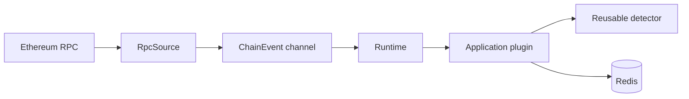

Raven is not limited to the `raven run` command. Its source, runtime, plugin
contract, normalized types, and bundled detectors are Rust library crates that
another application can compose directly.



This is the right integration when the application must use matched data in
code, such as writing a database record, calling an internal service, or
triggering an application workflow. Terminal tracing remains useful for
operators, but it is not a data API and should not be parsed as one.

## Add Git dependencies

Use Raven's Git repository instead of relative paths so the consumer remains
independent from a Raven checkout:

```toml
[dependencies]
raven-core = { git = "https://github.com/abhi3700/raven", branch = "feat/phase-1" }
raven-plugin-erc20-transfer = { git = "https://github.com/abhi3700/raven", branch = "feat/phase-1" }
raven-plugin-sdk = { git = "https://github.com/abhi3700/raven", branch = "feat/phase-1" }
raven-runtime = { git = "https://github.com/abhi3700/raven", branch = "feat/phase-1" }
raven-source-rpc = { git = "https://github.com/abhi3700/raven", branch = "feat/phase-1" }
```

The `raven` package itself is the CLI binary. Embedded applications should
depend on only the library packages they use. While Phase 1 is developed on
`feat/phase-1`, the sample names that branch explicitly. Pin a tested `rev` or
release tag for production reproducibility; switch to a release version when
the crates are published.

## Compose the application

The host application owns orchestration:

1. Construct `RpcSource` and give it a bounded `mpsc::Sender<ChainEvent>`.
2. Discover the chain ID from the first event and create one `Runtime` for it.
3. Register application and bundled plugins before `Runtime::start`.
4. Pass each event to `Runtime::process`.
5. Correlate `PluginOutcome` with the returned `DispatchId` when a side effect
   must complete before the application advances.
6. Abort or stop the source, then call `Runtime::shutdown` to drain accepted
   work.

```rust
let (sender, mut receiver) = tokio::sync::mpsc::channel(256);
let source = raven_source_rpc::RpcSource::new(rpc_url);
let source_task = tokio::spawn(source.run(sender));

let first_event = receiver.recv().await.expect("source remains open");
let mut runtime = raven_runtime::Runtime::new(first_event.chain_id());
let mut outcomes = runtime.subscribe_outcomes();

runtime.register_plugin(application_plugin)?;
runtime.start().await?;

let receipt = runtime.process(first_event).await?;
let outcome = outcomes.recv().await?;
assert_eq!(outcome.dispatch_id(), receipt.dispatch_id());
```

`Runtime::process` confirms mailbox delivery, not plugin completion. Waiting for
the correlated outcome is important when the plugin writes durable application
state and the next event must not be accepted after a failed write.

## Raven Redis Stash

The standalone sample at `crates/projects/raven-redis-stash` provides the full
implementation. It monitors Ethereum USDC transfers of at least 1,000 USDC by
default and stores each match under a deterministic identity:

```text
chain_id:block_hash:transaction_hash:log_index
```

Its Redis schema is:

| Key | Type | Meaning |
| --- | --- | --- |
| `raven:erc20:observations` | Hash | Latest JSON for every applied or reverted match |
| `raven:erc20:canonical` | Set | Match identities currently on the canonical chain |
| `raven:erc20:by_block` | Sorted set | Identities indexed by block number |

The plugin batches every match from one block into an atomic Redis transaction.
An applied block adds identities to the canonical set. A reverted block updates
the same observations to `reverted` and removes their identities from canonical
state. Replaying the same event overwrites the same hash fields and set members,
so writes are idempotent.

Run the sample:

```bash
cd crates/projects/raven-redis-stash
./run.sh
```

Fallbacks are Redis at `redis://127.0.0.1:1111` and the Chainlist-listed
Ethereum endpoint `https://ethereum-rpc.publicnode.com`. Both are configurable:

```bash
NODE_RPC_URL=https://your-ethereum-rpc.example \
REDIS_URL=redis://127.0.0.1:6379 \
./run.sh
```

The script starts a local `redis-server` on port `1111` when needed and launches
the Rust application with `cargo run`. It does not use Docker. Inspect canonical
matches with the local Redis CLI:

```bash
redis-cli -p 1111 SCARD raven:erc20:canonical
redis-cli -p 1111 --raw SRANDMEMBER raven:erc20:canonical
```

## Reliability boundary

The sample waits for Redis persistence before accepting the next source event,
and Redis operations are idempotent for replayed events. It deliberately starts
at the current chain head and does not reuse the CLI's checkpoint files.

An embedded production application that requires restart backfill must persist
its own canonical source cursor and reconstruct `SourceStart` from that state.
The CLI's checkpoint implementation is CLI-owned acknowledgement policy, not an
implicit guarantee added by `raven-runtime`.
