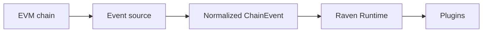

Raven is a source-independent event runtime with a plugin system for EVM
chains. It turns source-specific blockchain data into normalized events, then
delivers those events to reusable plugins.

<CardGroup cols={2}>
  <Card title="Run Raven" icon="rocket" href="/docs/getting-started/quickstart">
    Stream blocks from an Ethereum JSON-RPC endpoint with the Alloy source.
  </Card>
  <Card title="Build a plugin" icon="plug" href="/docs/guides/create-a-plugin">
    React to normalized chain events with a small Rust trait.
  </Card>
  <Card title="Understand the architecture" icon="blocks" href="/docs/concepts/architecture">
    See how sources, the runtime, dispatcher, and plugins fit together.
  </Card>
  <Card title="Read the design principles" icon="landmark" href="/docs/concepts/design-principles">
    Learn which responsibilities belong to sources, the runtime, and plugins.
  </Card>
  <Card title="Explore the crates" icon="package" href="/docs/reference/crates">
    Find the responsibility and stability boundary of every workspace crate.
  </Card>
</CardGroup>

## Why Raven?

Most blockchain applications repeatedly poll RPC endpoints and rebuild the same
ingestion, normalization, and dispatch logic. Raven extracts that pipeline into
shared infrastructure:

Source adapters own chain access. The core crate owns normalized types. The
runtime owns lifecycle and dispatch. Plugins own application behavior.

## Current capabilities

- Poll any standard Ethereum-compatible HTTP(S) or WS(S) JSON-RPC endpoint with Alloy.
- Discover the endpoint's EIP-155 chain ID.
- Fetch every block observed between polling intervals in ascending order.
- Normalize blocks into source-independent `ChainEvent` values.
- Register plugins by unique name and run their lifecycle.
- Reject events whose chain ID does not match the active runtime.
- Shut down cleanly when the CLI receives Ctrl+C.

<Note>
Raven is early-stage software. Reth ExEx support, reorg detection, dynamic
plugin installation, and persistent configuration are planned, not yet
implemented.
</Note>

## Design principle

> Everything is an event.

Blocks, transfers, swaps, liquidations, and contract deployments can all become
events. Raven keeps transport concerns out of plugins so a plugin can work with
multiple event sources without changing its business logic.
