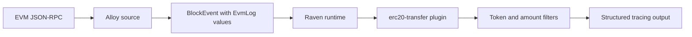

The ERC-20 transfer plugin detects token transfers at or above a configured
amount. It is Raven's first domain plugin and the reference layout for future
plugin crates and documentation pages.

| Item | Value |
| --- | --- |
| Crate directory | `crates/plugins/erc20-transfer/` |
| Cargo package | `raven-plugin-erc20-transfer` |
| Runtime plugin name | `erc20-transfer` |
| Current sink | Structured `tracing` output |
| RPC access | None |

Future plugin implementations belong in `crates/plugins/<plugin>/`, with their
corresponding user documentation in `docs/plugins/<plugin>.mdx` and a page added
to the **Plugins** group in `docs.json`.

## Processing flow

The Alloy source fetches generic EVM logs and includes them in the normalized
`BlockEvent`. The plugin derives ERC-20 meaning from that payload; it never
polls the node itself.



Keeping RPC access in the source means the same plugin can process normalized
events from another source implementation without changing its detection logic.

## Enable the plugin

The plugin is compiled into `raven run` but disabled by default. Enable it with
an inclusive raw-unit threshold:

```bash
raven run \
  --rpc-url http://localhost:8545 \
  --erc20-transfer-min-amount 1000000000000000000000
```

This configuration accepts matching transfers from any emitting contract.

### Different threshold for each token

Values are paired by position. This example matches transfers at or above
`1_000_000` for token A and at or above `5_000_000` for token B:

```bash
raven run \
  --rpc-url http://localhost:8545 \
  --erc20-transfer-min-amount 1000000 5000000 \
  --erc20-token 0x1111111111111111111111111111111111111111 0x2222222222222222222222222222222222222222
```

### One threshold for multiple tokens

A single amount is shared by every listed token. This example matches transfers
at or above `1_000_000` for both tokens:

```bash
raven run \
  --rpc-url http://localhost:8545 \
  --erc20-transfer-min-amount 1000000 \
  --erc20-token 0x1111111111111111111111111111111111111111 0x2222222222222222222222222222222222222222
```

| Option | Required | Meaning |
| --- | --- | --- |
| `--erc20-transfer-min-amount <RAW_UNITS>...` | Yes | One shared threshold or one positional threshold per token |
| `--erc20-token <ADDRESS>...` | No | Accepted emitting token contracts in threshold-pairing order |

Every threshold is inclusive, accepts decimal or `0x`-prefixed integer input,
and must be greater than zero. Multiple thresholds require the same number of
token addresses. With one threshold, token addresses are optional and the value
applies to every configured token, or every valid ERC-20 contract when no token
is supplied. Raven deliberately does not fetch or guess token decimals.
Configure amounts in each smart contract's smallest unit; for a token with 18
decimals, `1000000000000000000` represents one whole token.

<Note>
Enabling or changing the plugin does not replay an existing checkpoint. Use
`--start <BLOCK>` to backfill from an inclusive block, or keep the default
`--start resume` to monitor only activity after Raven's durable position.
</Note>

## Matching rules

For each normalized log, the plugin applies these checks in order:

1. The emitting address selects its positional threshold, unless one all-token threshold was configured.
2. Topic zero equals the standard ERC-20 `Transfer` signature hash.
3. Alloy validates and decodes `Transfer(address,address,uint256)`.
4. The decoded value is greater than or equal to the configured threshold.

```solidity
event Transfer(
    address indexed from,
    address indexed to,
    uint256 value
);
```

A match produces a `LargeTransfer` containing the token contract, sender,
recipient, raw amount, transaction hash, and block log index. Malformed logs or
logs with another signature do not produce a transfer.

## Applied and reverted blocks

The plugin processes the same normalized log payload for both chain-event
directions:

```text
BlockApplied(B, [L1, L2])
        |
        +-- matching log -> action=detected

shallow reorg removes B
        |
        v
BlockReverted(B, [L1, L2])
        |
        +-- same matching log -> action=reverted
```

Raven checkpoints the bounded block payload, including its logs. A retained
block removed by a shallow reorg can therefore produce correction telemetry
with the original transaction identity. Reverted blocks are delivered from the
old tip toward the common ancestor before replacement blocks are applied.

Each structured transfer record includes:

- `action`: `detected` or `reverted`
- `block_number` and `block_hash`
- `token`, `from`, and `to`
- `amount` in raw units
- `transaction_hash` and `log_index`

## Register from Rust

Applications embedding Raven can configure and register the same plugin
directly:

```rust
use alloy_primitives::{Address, U256};
use raven_plugin_erc20_transfer::{
    Erc20TransferConfig,
    Erc20TransferPlugin,
};

let token = "0x1111111111111111111111111111111111111111"
    .parse::<Address>()?;
let config = Erc20TransferConfig::new(
    U256::from(1_000_000_u64),
    [token],
)?;

runtime.register_plugin(Erc20TransferPlugin::new(config))?;
```

`Erc20TransferConfig::new` applies one shared threshold to every supplied token.
For individual thresholds, construct explicit `(Address, U256)` pairs:

```rust
use alloy_primitives::{Address, U256};
use raven_plugin_erc20_transfer::{
    Erc20TransferConfig,
    Erc20TransferPlugin,
};

let token_a = "0x1111111111111111111111111111111111111111"
    .parse::<Address>()?;
let token_b = "0x2222222222222222222222222222222222222222"
    .parse::<Address>()?;
let config = Erc20TransferConfig::new_with_token_thresholds([
    (token_a, U256::from(1_000_000_u64)),
    (token_b, U256::from(5_000_000_u64)),
])?;

runtime.register_plugin(Erc20TransferPlugin::new(config))?;
```

An empty address iterator passed to `new` monitors valid transfer logs from
every contract. That constructor sorts and deduplicates addresses sharing one
threshold. `new_with_token_thresholds` sorts token/amount pairs together and
rejects duplicate addresses.

## Delivery semantics

The plugin runs in its own bounded FIFO worker like every Raven plugin. It
processes one event at a time, while sibling plugins can execute independently.
The CLI advances its checkpoint only after this plugin and every other active
plugin report success.

Checkpoint recovery is at least once. A future external sink must use an
idempotency key based on fields such as chain ID, block hash, transaction hash,
log index, and event direction. The current tracing sink does not persist alert
state or send network notifications.

## Current limitations

- The plugin reports raw amounts and does not resolve token symbol or decimals.
- Any contract emitting a correctly encoded ERC-20 `Transfer` signature can match.
- Tracing is the only sink; webhook and messaging adapters remain planned.
- Token filters and thresholds are supplied at process startup.
- Dynamic plugin installation remains planned; this plugin is statically linked.

## Test and run

Run deterministic plugin tests:

```bash
cargo test -p raven-plugin-erc20-transfer
```

Run the opt-in live example against an EVM endpoint:

```bash
NODE_RPC_URL=https://your-evm-rpc.example \
ERC20_TRANSFER_MIN_AMOUNT=1000000 \
ERC20_TOKEN_ADDRESS=0x1111111111111111111111111111111111111111 \
cargo run -p raven-source-alloy --example e2e
```

The live example accepts one optional `ERC20_TOKEN_ADDRESS`. Use `raven run`
when repeatable token filters and CLI-owned durable checkpoints are required.
