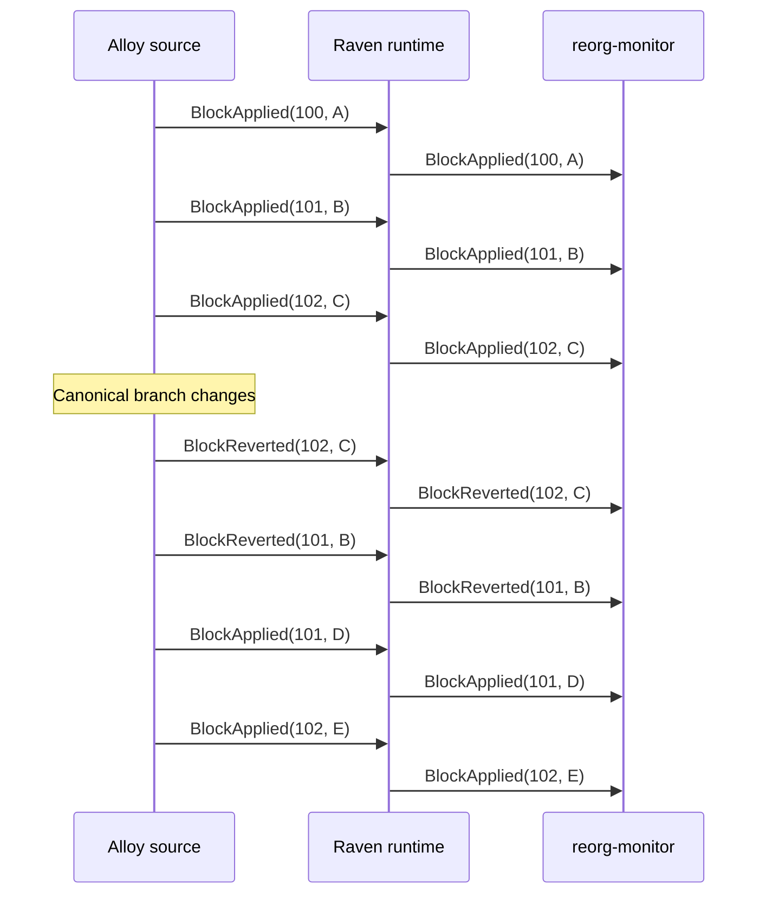

## Overview

`reorg-monitor` is a statically linked, opt-in Plugin that writes every
canonical-chain transition Raven delivers to tracing. It is useful for
observing a live source, verifying a checkpoint/reorg configuration, and as a
minimal reference for plugins that must correct state after a reorg.

Enable it with no additional configuration:

```bash
raven run \
  --rpc-url http://localhost:8545 \
  --reorg-monitor
```

It has no RPC client and does not independently detect forks. The Alloy source
owns canonical-chain reconciliation, validates block data, then supplies
normalized `ChainEvent` values to the runtime. The monitor only reports that
already-established transition.

## What it reports

Each `BlockApplied` event is logged at `INFO`; each `BlockReverted` event is
logged at `WARN`. Every record includes the chain ID, block number, block hash,
parent hash, timestamp, transaction count, and log count.

```text
INFO  block joined canonical chain
      event_type=BlockApplied block_number=100 block_hash=...0a
INFO  block joined canonical chain
      event_type=BlockApplied block_number=101 block_hash=...0b
INFO  block joined canonical chain
      event_type=BlockApplied block_number=102 block_hash=...0c

WARN  block left canonical chain; shallow reorg detected
      event_type=BlockReverted block_number=102 block_hash=...0c
WARN  block left canonical chain; shallow reorg detected
      event_type=BlockReverted block_number=101 block_hash=...0b

INFO  block joined canonical chain
      event_type=BlockApplied block_number=101 block_hash=...0d
INFO  block joined canonical chain
      event_type=BlockApplied block_number=102 block_hash=...0e
```

The letters in this example are the final byte of each distinct block hash.
This makes the reorg visible even where the replacement branch reuses the same
block heights.



## Reorg contract

Raven emits the old branch from its tip toward the common ancestor, followed
by replacement blocks in ascending height. The source can only correct forks
within the retained `--reorg-depth` window, which defaults to 64 blocks.

```text
old canonical branch: 100 A -> 101 B -> 102 C
                                      |
revert order:                        102 C, 101 B
                                      |
new canonical branch: 100 A -> 101 D -> 102 E
apply order:                                101 D, 102 E
```

A fork deeper than the retained canonical window is terminal; Raven does not
silently continue with an incomplete correction. `reorg-monitor` therefore
does not promise finality or persistent audit storage. It exposes what the
configured source successfully delivered during the current process.

## Use from Rust

Applications that compose their own runtime can register the same plugin
directly:

```rust
use raven_plugin_reorg_monitor::ReorgMonitorPlugin;

runtime.register_plugin(ReorgMonitorPlugin::new())?;
```

For a plugin that maintains balances, alerts, or external records, use this
same event direction to add state on `BlockApplied` and retract or compensate
state on `BlockReverted`. See [Events](/docs/concepts/events) for the complete
normalized event contract.
