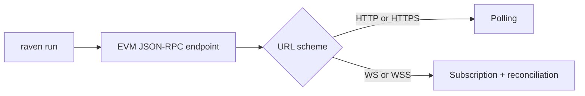

During development, prefix commands with:

```bash
cargo run -p raven --
```

After `cargo install --path crates/raven-cli`, invoke `raven` directly.

## Command presentation

Running `raven` without a command prints the Raven banner followed by the
top-level help. `raven run` also prints the banner before starting the runtime.
Management commands such as `plugins`, `doctor`, and `config` use compact output
so their result is immediately visible and easy to use in scripts.

Interactive terminals use Raven's blue and cyan palette, with green success,
yellow warning, and red error states. Redirected output falls back to plain text,
and the standard `NO_COLOR` environment variable disables color explicitly:

```bash
NO_COLOR=1 raven plugins list
```

## `raven run`

Start the event-processing loop.

```bash
raven run [--rpc-url <URL>] [OPTIONS]
```

| Option                              | Environment    | Default      | Description                                                   |
| ----------------------------------- | -------------- | ------------ | ------------------------------------------------------------- |
| `--rpc-url <URL>`                   | `NODE_RPC_URL` | Saved config | EVM-compatible HTTP(S) or WS(S) JSON-RPC endpoint             |
| `--poll-interval-ms <MS>`           | —              | `4000`       | HTTP(S) block-number poll interval; must be greater than zero |
| `--reconciliation-interval-ms <MS>` | —              | `30000`      | WS(S) safety reconciliation; must be greater than zero        |
| `--start <POSITION>`                | —              | `resume`     | `resume`, `latest`, or an inclusive block height              |
| `--reorg-depth <BLOCKS>`            | —              | `64`         | Canonical ancestry retained for shallow-fork correction       |
| `--block-fetch-mode <MODE>`         | —              | `batch`      | Block/log retrieval mode: `batch` or `sequential`             |

Example:

```bash
raven run \
  --rpc-url http://localhost:8545 \
  --poll-interval-ms 1000
```

The endpoint may represent any EVM chain and use `http://`, `https://`, `ws://`,
or `wss://`. Raven discovers its chain ID with `eth_chainId`; there is no
hard-coded allowlist. HTTP(S) uses the polling interval. WS(S) uses
`eth_subscribe("newHeads")` as its primary trigger and the reconciliation
interval as a safety check. Both feed the same ordered full-block catch-up path.

`batch` sends `eth_getBlockByNumber` and a same-height `eth_getLogs` call in one
JSON-RPC packet, then validates the returned block and logs together. Use
`--block-fetch-mode sequential` when an endpoint rejects batch packets or an
operator wants the original block-first, hash-pinned log request.

The default `--start resume` loads a chain-specific checkpoint. If none exists,
it starts at the current head. `latest` deliberately ignores the checkpoint;
a numeric value backfills from that block inclusively. The checkpoint advances
only after every plugin reports success, so a crash or plugin failure replays
the unacknowledged event on restart.

### ERC-20 transfer monitor

The `erc20-transfer` plugin is bundled with Raven but runs only after it is
installed into the persisted configuration. Thresholds accept decimal or
`0x`-prefixed `uint256` values and must be greater than zero. Token values are
typed EVM addresses. One amount applies to every token; multiple amounts pair
positionally with the same number of token addresses:

```bash
raven plugins install erc20-transfer \
  --min-amount 1000000 5000000 \
  --token 0x1111111111111111111111111111111111111111 0x2222222222222222222222222222222222222222
raven run --rpc-url https://your-evm-rpc.example
```

The plugin decodes normalized logs supplied by the source; it does not issue
RPC requests. It logs `action=detected` for applied blocks and `action=reverted`
for matching logs in blocks removed by a shallow reorg. This tracing output is
the current sink. Webhooks and other production notification adapters remain
planned.

Installing or changing this plugin does not retroactively replay an existing
checkpoint. Use `raven run --start <BLOCK>` when the new configuration must
backfill historical transfers; use the default `resume` when only future
activity is required.

### Reorg monitor

The `reorg-monitor` plugin is also bundled and activated through persisted
configuration:

```bash
raven plugins install reorg-monitor
raven run --rpc-url https://your-evm-rpc.example
```

It logs every `BlockApplied` event at `INFO` and every `BlockReverted` event at
`WARN`, including the chain ID and exact block identity. It does not make RPC
calls or discover forks itself; it observes the shallow-reorg order established
by the source: old tip-to-ancestor reverts, then ascending replacement applies.
See the [reorg monitor plugin guide](/docs/plugins/reorg-monitor) for a complete
sequence and its operational limits.

### Why there is no `--source`

`raven run` is the standalone JSON-RPC deployment. Alloy is the Rust library
that currently implements this path; it is not an operator-facing source type.
Likewise, a self-hosted RPC endpoint and a hosted provider expose the same
protocol, and the endpoint URL cannot reliably identify who operates it.



Reth ExEx ingestion will not be added as `raven run --source reth`. An ExEx is
compiled into the same binary as Reth and launched with the node. The planned
integration is therefore a version-pinned Raven-enabled **Reth CLI**: operators
will run `reth node` with Raven/plugin configuration and the builder will
install Raven as an ExEx. This keeps incompatible deployment configuration out
of `raven run` and keeps the default CLI free of Reth's dependency footprint.

Passing the removed `--source` option is an error. Existing commands should
drop `--source alloy`; no replacement option is needed.

The RPC URL is resolved before Raven starts:

```text
--rpc-url  ─►  NODE_RPC_URL  ─►  config.json  ─►  error with setup instructions
```

An explicit flag therefore overrides the environment, and the environment
overrides persisted config. If all three are absent, `raven run` exits with:

```text
Error: no RPC URL configured
  pass `--rpc-url <URL>`, set `NODE_RPC_URL`, or run `raven config set --rpc-url <URL>`
```

## `raven plugins list`

Report plugins known to the CLI and their activation state:

```bash
raven plugins list
```

Current output:

```text
Built-in plugins
  ● block-logger  always active with `raven run`

Bundled plugins
  ● erc20-transfer  installed
  ○ reorg-monitor  not installed

External plugins
  ○ Loading support is planned
```

`Built-in` means Raven always registers the plugin. `Bundled` means its code is
compiled into Raven but activation and settings are persisted by
`raven plugins install`. `External` is reserved for separately distributed
plugins; discovery and dynamic loading are planned but are not implemented.

Add `--details` to inspect each plugin's origin, accepted arguments, and saved
values without opening `config.json`:

```bash
raven plugins list --details
```

## `raven plugins install`

Persist and activate a bundled plugin. Installing an already-installed plugin
replaces its saved settings.

### ERC-20 transfer options

```bash
raven plugins install erc20-transfer \
  --min-amount <RAW_UNITS>... \
  [--token <ADDRESS>...] \
  [--short]
```

| Option | Required | Description |
| --- | --- | --- |
| `--min-amount <RAW_UNITS>...` | Yes | One shared threshold or one positional threshold per token |
| `--token <ADDRESS>...` | No | Accepted emitting token contracts in threshold-pairing order |
| `--short` | No | Abbreviate hashes and addresses in each report |

Without `--short`, reports retain complete block hashes, transaction hashes,
and addresses. The option is saved with the plugin, so `raven run` needs no
plugin-specific arguments.

### Reorg monitor options

The reorg monitor has no plugin-specific settings:

```bash
raven plugins install reorg-monitor
```

Plugin-specific options supplied to a different plugin are rejected instead of
being silently ignored. `raven plugin ...` is accepted as a singular alias, but
the documented command is `raven plugins ...`.

## `raven plugins remove`

Deactivate a bundled plugin and remove its saved settings:

```bash
raven plugins remove erc20-transfer
raven plugins remove reorg-monitor
```

The `block-logger` cannot be installed or removed because it is always part of
`raven run`.

External names still report the unimplemented loading boundary:

```console
$ raven plugins install whale-detector
Error: external plugin installation is not available yet
  requested: whale-detector
  status: loading support is planned
```

These errors intentionally omit Rust source locations and backtraces from normal
CLI output.

## `raven doctor`

Validate configuration and test RPC connectivity without starting ingestion:

```bash
raven doctor [--rpc-url <URL>] [--timeout-ms <MS>]
```

The RPC URL uses the same flag, `NODE_RPC_URL`, and persisted-config precedence
as `raven run`. On success, the command prints the CLI version, selected
transport, discovered chain ID, latest block, and check latency. Invalid
configuration, connection failure, or timeout exits unsuccessfully.

## `raven config set`

Validate and persist an RPC endpoint:

```bash
raven config set --rpc-url wss://your-evm-rpc.example
```

The command accepts `http`, `https`, `ws`, and `wss` URLs. It preserves installed
plugin settings, writes through a temporary file before replacement, and uses
owner-only file permissions on Unix because endpoint URLs may contain provider
credentials.

## `raven config get`

Print the persisted RPC URL and config path:

```bash
raven config get
```

Example output:

```yaml
rpc_url: https://your-evm-rpc.example
config_file: /Users/example/Library/Application Support/raven/config.json
```

This reports persisted state only. It does not replace the value with a
temporary `NODE_RPC_URL` override.

## `raven config clear`

Remove all persisted Raven configuration, including the RPC URL and bundled
plugin installations:

```bash
raven config clear
```

Clearing is idempotent: running it when no config file exists still succeeds.

Raven stores the file in the native per-user config directory:

| Platform             | Default path                                                           |
| -------------------- | ---------------------------------------------------------------------- |
| macOS                | `~/Library/Application Support/raven/config.json`                      |
| Linux and other Unix | `$XDG_CONFIG_HOME/raven/config.json`, or `~/.config/raven/config.json` |
| Windows              | `%APPDATA%\raven\config.json`                                          |

Set `RAVEN_CONFIG_DIR` to override the directory, which is especially useful
for isolated development and automated tests.

## Logging

Raven uses `tracing` and reads `RUST_LOG`:

```bash
RUST_LOG=raven=debug,raven_plugin_=debug,raven_source_alloy=debug \
  raven run --rpc-url http://localhost:8545
```

The default filter enables info logs for the CLI, statically linked
`raven-plugin-*` crates, and Alloy-backed RPC adapter. Set `RUST_LOG` to
override those directives when a different level or target set is needed.

In an interactive terminal, Raven also colors structured log fields by value
type: strings and URLs are cyan, numbers are yellow, booleans are green or red,
hashes are magenta, and errors are red. Field names remain dim so values are
easy to scan. These colors follow the same ANSI and `NO_COLOR` behavior as the
rest of the CLI.

When the CLI registers a plugin, it also assigns that plugin a generated,
distinct terminal hue. Every tracing event emitted inside the plugin's
`start`, `handle_event`, or `shutdown` call is prefixed with a compact colored
name tag. This keeps interleaved output attributable when several plugins
observe the same block:

```text
2026-08-31T08:10:33.010953Z  INFO [ block-logger ] raven::runner: processed block block_number=119117087 ...
2026-08-31T08:10:33.012144Z  INFO [ erc20-transfer ] raven_plugin_erc20_transfer: +-- ERC-20 transfer matches ---
| block=119117087 hash=0x594c...f29e53 action=detected matches=2
|  1. token=0x1111...111111 amount=1000000 log_index=4
|     from=0xaaaa...aaaaaa -> to=0xbbbb...bbbbbb tx=0xcccc...cccccc
+------------------------------------------------------------------------
2026-08-31T08:10:33.013998Z  WARN [ reorg-monitor ] raven_plugin_reorg_monitor: block left canonical chain; shallow reorg detected ...
```

The tag is the visual boundary for output from one plugin. Most tracing events
occupy one terminal line; the ERC-20 transfer plugin intentionally emits each
matching block as one multiline report so its rows cannot interleave with other
plugins. Colors are deterministic for the same plugin registration order and
are distinct for the first 360 registered plugins. Source, runtime, checkpoint,
and CLI orchestration logs do not receive a plugin tag. With `NO_COLOR` or
redirected output, the same `[ plugin-name ]` text remains without ANSI color.
