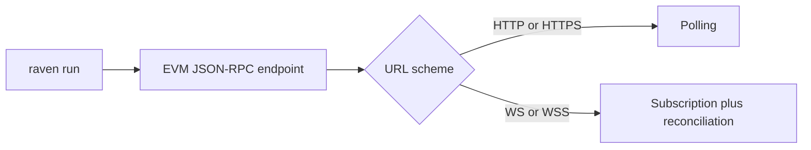

During development, prefix commands with:

```bash
cargo run -p raven --
```

After `cargo install --path crates/raven-cli`, invoke `raven` directly.

## Command presentation

Running `raven` without a command prints the Raven banner followed by the
top-level help. `raven run` also prints the banner before starting the runtime.
Management commands such as `plugins`, `doctor`, and `config` use compact output
so their result is immediately visible and easy to use in scripts.

## `raven run`

Start the event-processing loop.

```bash
raven run [--rpc-url <URL>] [OPTIONS]
```

| Option                              | Environment    | Default      | Description                                                   |
| ----------------------------------- | -------------- | ------------ | ------------------------------------------------------------- |
| `--rpc-url <URL>`                   | `NODE_RPC_URL` | Saved config | EVM-compatible HTTP(S) or WS(S) JSON-RPC endpoint             |
| `--poll-interval-ms <MS>`           | —              | `4000`       | HTTP(S) block-number poll interval; must be greater than zero |
| `--reconciliation-interval-ms <MS>` | —              | `30000`      | WS(S) safety reconciliation; must be greater than zero        |

Example:

```bash
raven run \
  --rpc-url http://localhost:8545 \
  --poll-interval-ms 1000
```

The endpoint may represent any EVM chain and use `http://`, `https://`, `ws://`,
or `wss://`. Raven discovers its chain ID with `eth_chainId`; there is no
hard-coded allowlist. HTTP(S) uses the polling interval. WS(S) uses
`eth_subscribe("newHeads")` as its primary trigger and the reconciliation
interval as a safety check. Both feed the same ordered full-block catch-up path.

### Why there is no `--source`

`raven run` is the standalone JSON-RPC deployment. Alloy is the Rust library
that currently implements this path; it is not an operator-facing source type.
Likewise, a self-hosted RPC endpoint and a hosted provider expose the same
protocol, and the endpoint URL cannot reliably identify who operates it.



Reth ExEx ingestion will not be added as `raven run --source reth`. An ExEx is
compiled into the same binary as Reth and launched with the node, so the
planned integration is a separate Raven-enabled Reth binary with its own node
arguments. This keeps incompatible deployment configuration out of
`raven run` and keeps the default CLI free of Reth's dependency footprint.

Passing the removed `--source` option is an error. Existing commands should
drop `--source alloy`; no replacement option is needed.

The RPC URL is resolved before Raven starts:

```text
--rpc-url  ─►  NODE_RPC_URL  ─►  config.json  ─►  error with setup instructions
```

An explicit flag therefore overrides the environment, and the environment
overrides persisted config. If all three are absent, `raven run` exits with:

```text
Error: no RPC URL configured
  pass `--rpc-url <URL>`, set `NODE_RPC_URL`, or run `raven config set --rpc-url <URL>`
```

## `raven plugins list`

Report built-in and external plugins known to the CLI:

```bash
raven plugins list
```

Current output:

```text
Built-in plugins
  block-logger  bundled with `raven run`

External plugins
  None installed (installation is planned)
```

The current CLI does not have persistent external-plugin discovery. The
built-in `block-logger` used by `raven run` does not need to be installed.

## Planned plugin commands

`raven plugins install <PLUGIN>` and `raven plugins remove <PLUGIN>` reserve the
future external-plugin management interface. They currently exit unsuccessfully
with a concise “not available yet” error and do not modify the system.

For example, trying to install the built-in logger explains that it is already
part of `raven run`:

```console
$ raven plugins install blocklogger
Error: external plugin installation is not available yet
  requested: blocklogger
  note: `block-logger` is built into `raven run` and needs no installation
```

Other external plugin names report their current status:

```console
$ raven plugins install whale-detector
Error: external plugin installation is not available yet
  requested: whale-detector
  status: planned
```

These errors intentionally omit Rust source locations and backtraces from
normal CLI output.

## `raven doctor`

Print the Raven CLI version and confirm that the executable starts:

```bash
raven doctor
```

This is a lightweight binary check. It does not currently test RPC
connectivity, storage, or plugin loading.

## `raven config set`

Validate and persist an RPC endpoint:

```bash
raven config set --rpc-url wss://your-evm-rpc.example
```

The command accepts `http`, `https`, `ws`, and `wss` URLs. It writes through a
temporary file before replacement and uses owner-only file permissions on Unix
because endpoint URLs may contain provider credentials.

## `raven config get`

Print the persisted RPC URL and config path:

```bash
raven config get
```

Example output:

```yaml
rpc_url: https://your-evm-rpc.example
config_file: /Users/example/Library/Application Support/raven/config.json
```

This reports persisted state only. It does not replace the value with a
temporary `NODE_RPC_URL` override.

## `raven config clear`

Remove all persisted Raven configuration:

```bash
raven config clear
```

Clearing is idempotent: running it when no config file exists still succeeds.

Raven stores the file in the native per-user config directory:

| Platform | Default path |
| --- | --- |
| macOS | `~/Library/Application Support/raven/config.json` |
| Linux and other Unix | `$XDG_CONFIG_HOME/raven/config.json`, or `~/.config/raven/config.json` |
| Windows | `%APPDATA%\raven\config.json` |

Set `RAVEN_CONFIG_DIR` to override the directory, which is especially useful
for isolated development and automated tests.

## Logging

Raven uses `tracing` and reads `RUST_LOG`:

```bash
RUST_LOG=raven=debug,raven_source_alloy=debug \
  raven run --rpc-url http://localhost:8545
```

The default filter enables info logs for the CLI and Alloy-backed RPC adapter.
