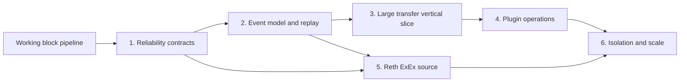

Raven is under active development. This roadmap distinguishes executable
behavior from proposals and orders work by the contracts later features depend
on.

## Development sequence



The numbering expresses dependency order, not calendar commitments. Work can
overlap when it does not require an undecided contract.

## Available now

- [x] Validated chain IDs and normalized block events
- [x] Validation-preserving construction and deserialization
- [x] Applied and reverted variants in the core model
- [x] Plugin trait and lifecycle context
- [x] Unique-name plugin registry
- [x] One independent Tokio worker and bounded FIFO mailbox per plugin
- [x] Non-blocking fan-out with per-plugin delivery receipts
- [x] Live success, error, panic, and rejection outcomes in completion order
- [x] Handler-error isolation and per-worker panic quarantine
- [x] Concurrent plugin startup and graceful parallel drain on shutdown
- [x] Runtime state and event-chain validation
- [x] Alloy HTTP(S) JSON-RPC block polling
- [x] Alloy WS(S) `newHeads` subscription with periodic reconciliation
- [x] Ordered catch-up across blocks missed between polls or notifications
- [x] Persistent RPC URL configuration with CLI and environment precedence
- [x] Working `raven run` orchestration and Ctrl+C shutdown
- [x] Built-in block logging

## Recommended next milestone: reliable canonical blocks

Before Raven grows the event enum or ships stateful plugins, make block
delivery and recovery explicit.

1. **Define delivery semantics.** Choose and document at-least-once delivery,
   checkpoint ownership, and when a checkpoint becomes durable.
2. **Finish lifecycle supervision.** Add startup, handler, and shutdown
   timeouts; decide restart policy; expose worker health; and report multiple
   lifecycle failures without abandoning cleanup.
3. **Add source retry policy.** Categorize transient and terminal RPC failures,
   use capped exponential backoff with jitter, and expose retry telemetry.
4. **Add start position and checkpoints.** Support latest, explicit block
   height, and persisted resume without silently skipping history.
5. **Detect shallow reorgs.** Maintain a bounded canonical window and emit
   `BlockReverted` values before replacement `BlockApplied` values.
6. **Test the contract.** Use deterministic mocked RPC fixtures for missed
   blocks, temporary omissions, retries, restarts, and competing forks.

Exit criteria:

- A restart resumes from a documented checkpoint without an unexplained gap.
- A tested shallow fork produces reverted blocks followed by replacement blocks
  in deterministic order.
- A timed-out or failing lifecycle hook cannot prevent cleanup of other
  plugins.
- `raven doctor` can check configuration and RPC connectivity without starting
  the event loop.

## Event model and replay

The initial notes envision blocks, transactions, logs, transfers, swaps, and
reorganizations. Add them in layers instead of making every source eagerly
materialize every possible object:

```text
source-native data
    └─► canonical chain events
            └─► decoded protocol or token events
                    └─► plugin-owned application state and alerts
```

Planned decisions and work:

- [ ] Decide whether transactions and logs are core variants, optional block
  payloads, or derived events.
- [ ] Define a versioning policy for serialized events before durable storage.
- [ ] Add fixture builders and round-trip tests for every normalized type.
- [ ] Keep shutdown and other runtime controls outside `ChainEvent`.
- [ ] Add replay APIs only after ordering and checkpoint semantics are stable.

## First vertical slice: large ERC-20 transfers

Use the large-transfer monitor from the initial Raven concept as the first
end-to-end plugin. It exercises logs, configuration, state, and output without
requiring DEX-specific decoding.

- [ ] Normalize or expose the receipt/log data required for ERC-20 `Transfer`.
- [ ] Implement a statically registered transfer plugin with address and amount
  thresholds.
- [ ] Prove that the plugin performs no chain polling of its own.
- [ ] Handle reverted blocks so an alert or stored observation can be corrected.
- [ ] Add one production-shaped sink, such as a webhook; keep Telegram as a
  follow-up adapter rather than coupling it to detection logic.
- [ ] Provide deterministic unit tests and one opt-in live E2E example.

After that slice is sound, DEX swaps, portfolios, whale activity, databases,
message queues, and Telegram notifications can reuse the same contracts.

## Plugin operations

Prefer statically linked, configured plugins before dynamic loading:

- [ ] Add typed configuration and plugin enable/disable controls.
- [ ] Add scoped storage, metrics, and cancellation capabilities to
  `PluginContext` as concrete use cases require them.
- [ ] Define priorities and dependencies only if real plugins need ordering.
- [ ] Specify plugin identity, compatibility, trust, and upgrade rules.
- [ ] Implement discovery, installation, removal, and dynamic loading after the
  security and ABI boundaries are explicit.

The existing `raven plugins install` and `remove` commands remain intentional
not-implemented errors until this phase.

## Additional sources and scale

- [ ] Build `raven-source-reth` from ExEx notifications into the same validated
  event model.
- [ ] Compare Alloy and Reth behavior, then extract a shared source trait if the
  two implementations demonstrate a useful common interface.
- [x] Use WebSocket subscriptions with ordered height-gap reconciliation.
- [ ] Define Raven-level terminal reconnect policy and checkpoint-based resume.
- [ ] Add configurable per-plugin timeouts, restart supervision, health status,
  and dead-letter handling while preserving current FIFO guarantees.
- [ ] Add durable queues or a distributed runtime only after profiling shows a
  single process is the limiting boundary.

## Decisions to record before implementation

| Decision | Why it blocks later work |
| --- | --- |
| At-least-once delivery and checkpoint commit point | Determines replay and plugin idempotency |
| Reorg depth and finality policy | Determines canonical-state correction |
| Core versus derived event granularity | Determines source cost and plugin portability |
| Plugin timeout and restart policy | Determines supervision and recovery guarantees |
| Static versus dynamic plugin packaging | Determines security, compatibility, and CLI design |

<Note>
Roadmap items describe direction, not release commitments. Refer to the CLI
reference for commands that are executable today.
</Note>
